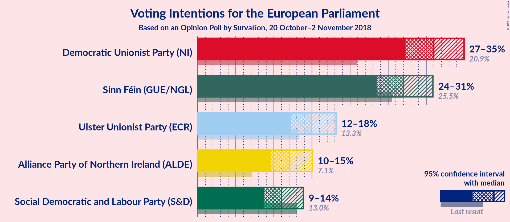
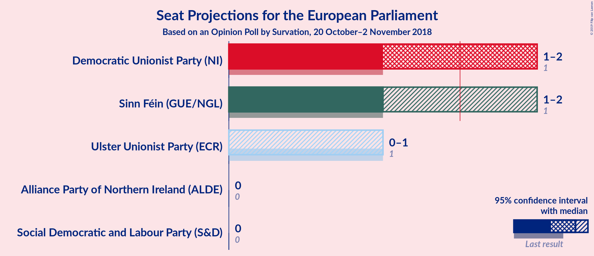
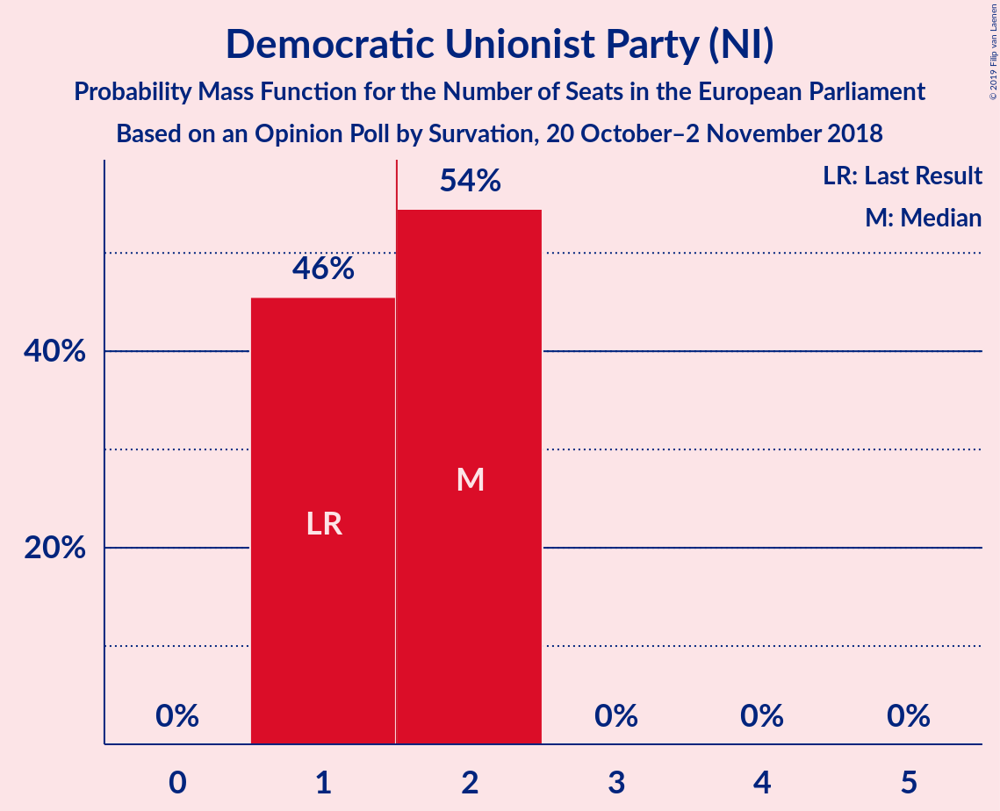
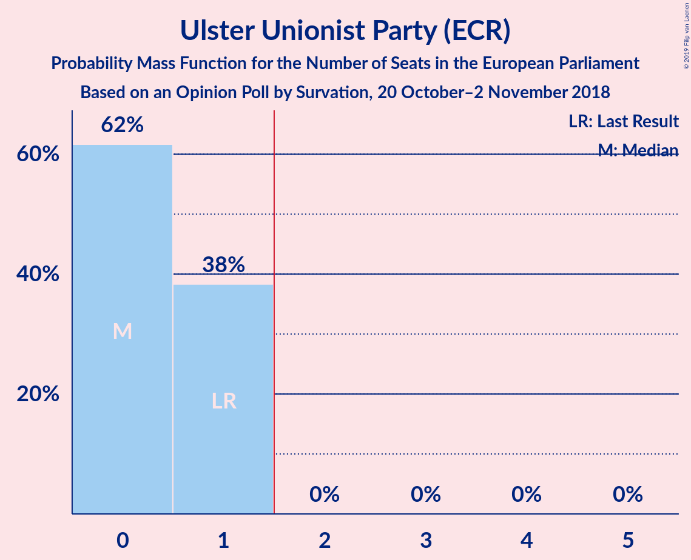
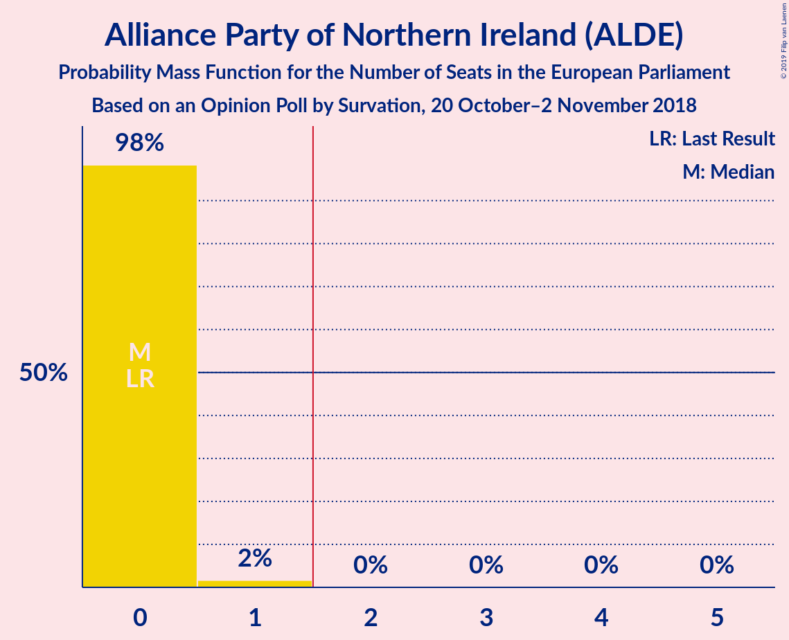
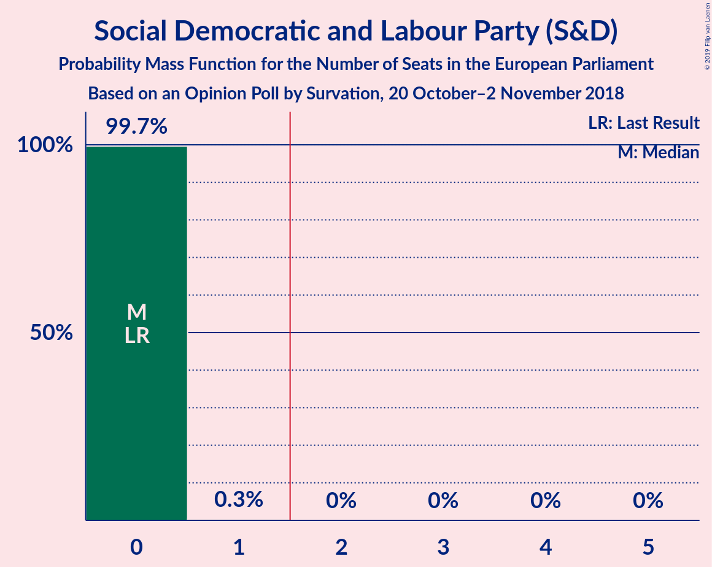
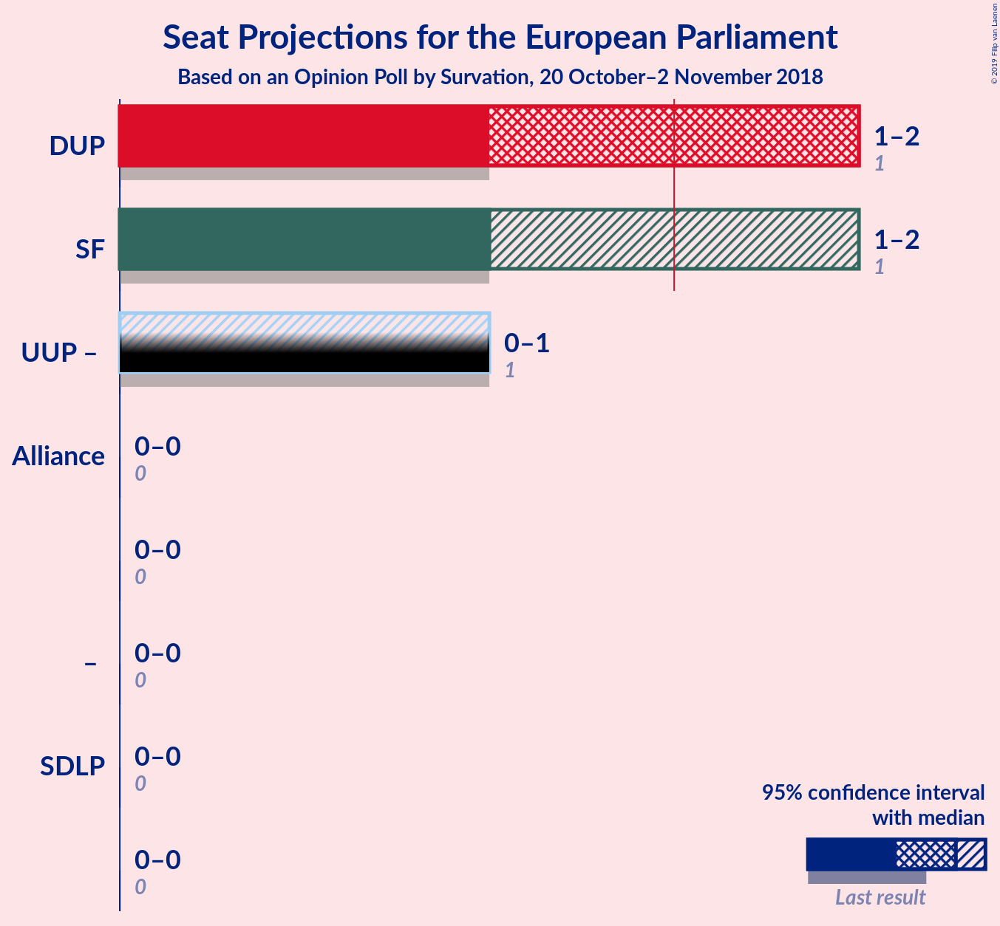
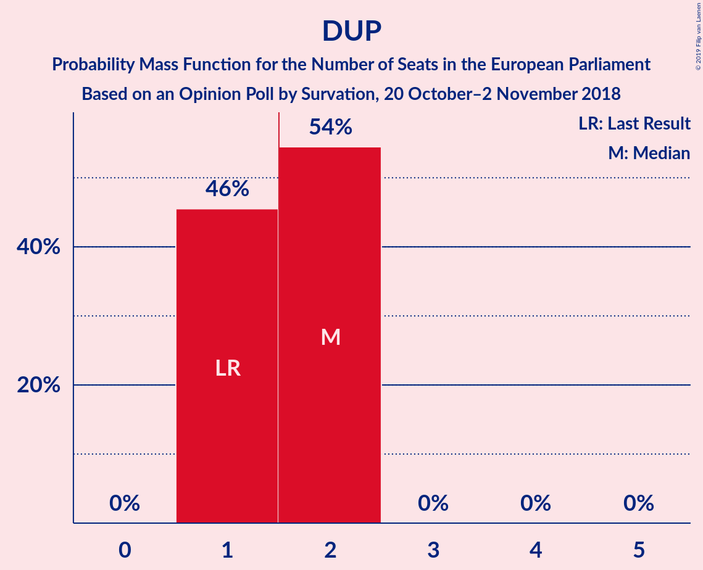
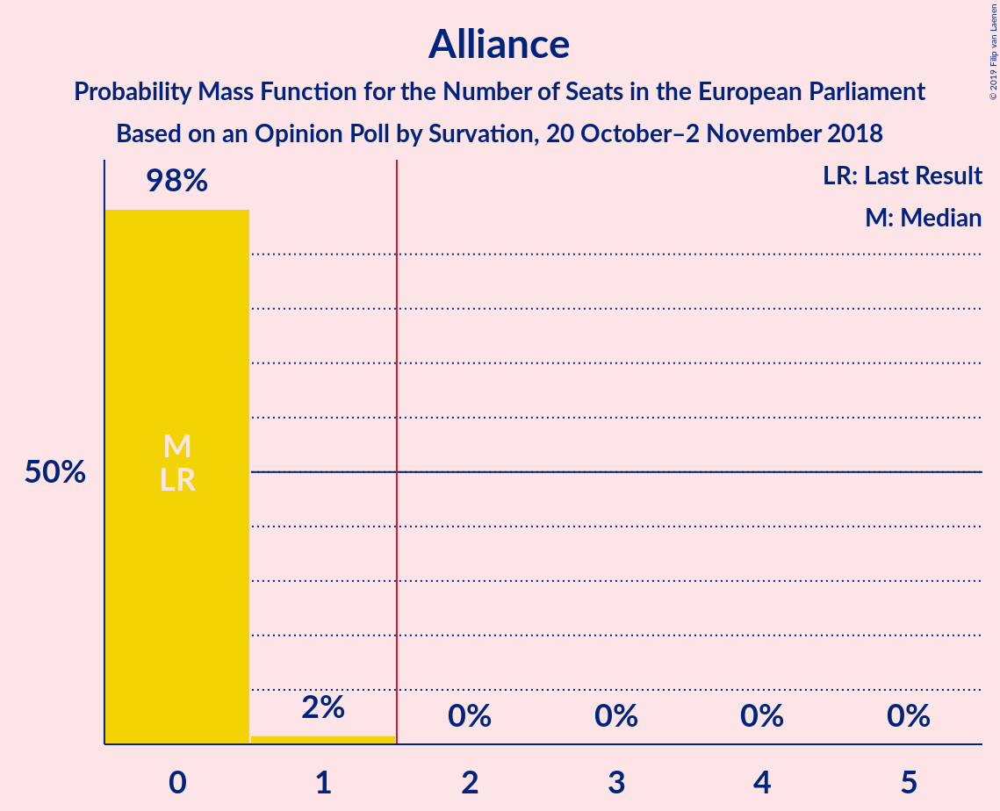
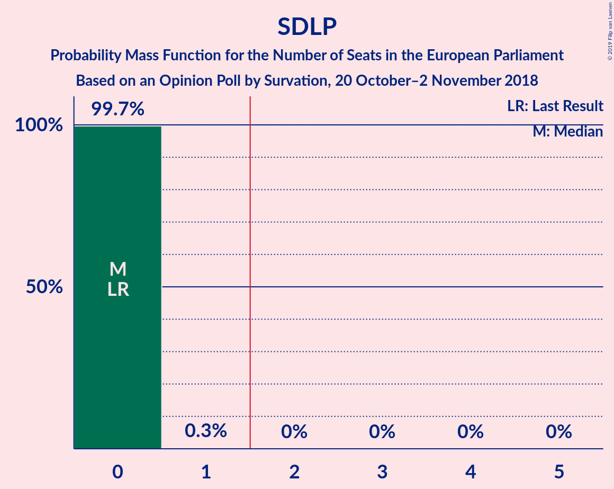

# Opinion Poll by Survation, 20 October–2 November 2018

<a href="#voting-intentions">Voting Intentions</a> | <a href="#seats">Seats</a> | <a href="#coalitions">Coalitions</a> | <a href="#technical-information">Technical Information</a>

## Voting Intentions

### Confidence Intervals

| Party | Last Result | Poll Result | 80% Confidence Interval | 90% Confidence Interval | 95% Confidence Interval | 99% Confidence Interval |
|:-----:|:-----------:|:-----------:|:-----------------------:|:-----------------------:|:-----------------------:|:-----------------------:|
| Democratic Unionist Party (NI) | 20.9% | 31.0% | 28.6–33.6% |27.9–34.3% |27.3–35.0% |26.1–36.2% |
| Sinn Féin (GUE/NGL) | 25.5% | 27.0% | 24.7–29.6% |24.1–30.3% |23.5–30.9% |22.4–32.1% |
| Ulster Unionist Party (ECR) | 13.3% | 15.0% | 13.2–17.1% |12.7–17.6% |12.2–18.2% |11.4–19.2% |
| Alliance Party of Northern Ireland (ALDE) | 7.1% | 12.1% | 10.5–14.0% |10.0–14.6% |9.6–15.1% |8.9–16.0% |
| Social Democratic and Labour Party (S&D) | 13.0% | 11.0% | 9.4–12.9% |9.0–13.4% |8.7–13.9% |8.0–14.8% |

*Note:* The poll result column reflects the actual value used in the calculations. Published results may vary slightly, and in addition be rounded to fewer digits.

## Seats

### Confidence Intervals

| Party | Last Result | Median | 80% Confidence Interval | 90% Confidence Interval | 95% Confidence Interval | 99% Confidence Interval |
|:-----:|:-----------:|:------:|:-----------------------:|:-----------------------:|:-----------------------:|:-----------------------:|
| <a href="#democratic-unionist-party-(ni)">Democratic Unionist Party (NI)</a> | 1 | 2 | 1–2 |1–2 |1–2 |1–2 |
| <a href="#sinn-féin-(gue/ngl)">Sinn Féin (GUE/NGL)</a> | 1 | 1 | 1 |1–2 |1–2 |1–2 |
| <a href="#ulster-unionist-party-(ecr)">Ulster Unionist Party (ECR)</a> | 1 | 0 | 0–1 |0–1 |0–1 |0–1 |
| <a href="#alliance-party-of-northern-ireland-(alde)">Alliance Party of Northern Ireland (ALDE)</a> | 0 | 0 | 0 |0 |0 |0–1 |
| <a href="#social-democratic-and-labour-party-(s&d)">Social Democratic and Labour Party (S&D)</a> | 0 | 0 | 0 |0 |0 |0 |

### Democratic Unionist Party (NI)

*For a full overview of the results for this party, see the [Democratic Unionist Party (NI)](party-democraticunionistpartyni.html) page.*

| Number of Seats | Probability | Accumulated | Special Marks |
|:---------------:|:-----------:|:-----------:|:-------------:|
| 1 | 46% | 100% | Last Result |
| 2 | 54% | 54% | Median, Majority |
| 3 | 0% | 0% |  |

### Sinn Féin (GUE/NGL)

*For a full overview of the results for this party, see the [Sinn Féin (GUE/NGL)](party-sinnféinguengl.html) page.*

| Number of Seats | Probability | Accumulated | Special Marks |
|:---------------:|:-----------:|:-----------:|:-------------:|
| 1 | 95% | 100% | Last Result, Median |
| 2 | 5% | 5% | Majority |
| 3 | 0% | 0% |  |

### Ulster Unionist Party (ECR)

*For a full overview of the results for this party, see the [Ulster Unionist Party (ECR)](party-ulsterunionistpartyecr.html) page.*

| Number of Seats | Probability | Accumulated | Special Marks |
|:---------------:|:-----------:|:-----------:|:-------------:|
| 0 | 62% | 100% | Median |
| 1 | 38% | 38% | Last Result |
| 2 | 0% | 0% | Majority |

### Alliance Party of Northern Ireland (ALDE)

*For a full overview of the results for this party, see the [Alliance Party of Northern Ireland (ALDE)](party-alliancepartyofnorthernirelandalde.html) page.*

| Number of Seats | Probability | Accumulated | Special Marks |
|:---------------:|:-----------:|:-----------:|:-------------:|
| 0 | 98% | 100% | Last Result, Median |
| 1 | 2% | 2% |  |
| 2 | 0% | 0% | Majority |

### Social Democratic and Labour Party (S&D)

*For a full overview of the results for this party, see the [Social Democratic and Labour Party (S&D)](party-socialdemocraticandlabourpartysd.html) page.*

| Number of Seats | Probability | Accumulated | Special Marks |
|:---------------:|:-----------:|:-----------:|:-------------:|
| 0 | 99.7% | 100% | Last Result, Median |
| 1 | 0.3% | 0.3% |  |
| 2 | 0% | 0% | Majority |

## Coalitions

### Confidence Intervals

| Coalition | Last Result | Median | Majority? | 80% Confidence Interval | 90% Confidence Interval | 95% Confidence Interval | 99% Confidence Interval |
|:---------:|:-----------:|:------:|:---------:|:-----------------------:|:-----------------------:|:-----------------------:|:-----------------------:|
| Democratic Unionist Party (NI) | 1 | 2 | 54% | 1–2 | 1–2 | 1–2 | 1–2 |
| Sinn Féin (GUE/NGL) | 1 | 1 | 5% | 1 | 1–2 | 1–2 | 1–2 |
| Alliance Party of Northern Ireland (ALDE) | 0 | 0 | 0% | 0 | 0 | 0 | 0–1 |
| Social Democratic and Labour Party (S&D) | 0 | 0 | 0% | 0 | 0 | 0 | 0 |

### Democratic Unionist Party (NI)

| Number of Seats | Probability | Accumulated | Special Marks |
|:---------------:|:-----------:|:-----------:|:-------------:|
| 1 | 46% | 100% | Last Result |
| 2 | 54% | 54% | Median, Majority |
| 3 | 0% | 0% |  |

### Sinn Féin (GUE/NGL)

| Number of Seats | Probability | Accumulated | Special Marks |
|:---------------:|:-----------:|:-----------:|:-------------:|
| 1 | 95% | 100% | Last Result, Median |
| 2 | 5% | 5% | Majority |
| 3 | 0% | 0% |  |

### Alliance Party of Northern Ireland (ALDE)

| Number of Seats | Probability | Accumulated | Special Marks |
|:---------------:|:-----------:|:-----------:|:-------------:|
| 0 | 98% | 100% | Last Result, Median |
| 1 | 2% | 2% |  |
| 2 | 0% | 0% | Majority |

### Social Democratic and Labour Party (S&D)

| Number of Seats | Probability | Accumulated | Special Marks |
|:---------------:|:-----------:|:-----------:|:-------------:|
| 0 | 99.7% | 100% | Last Result, Median |
| 1 | 0.3% | 0.3% |  |
| 2 | 0% | 0% | Majority |

## Technical Information

### Opinion Poll

+ **Polling firm:** Survation
+ **Commissioner(s):** —
+ **Fieldwork period:** 20 October–2 November 2018

### Calculations

+ **Sample size:** 555
+ **Simulations done:** 1,048,576
+ **Error estimate:** 0.46%

