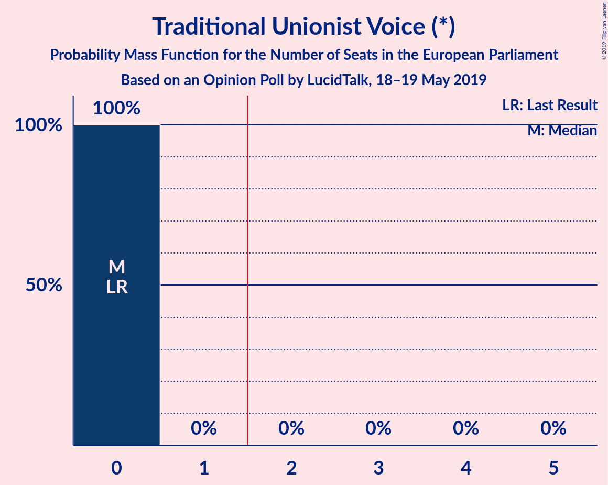
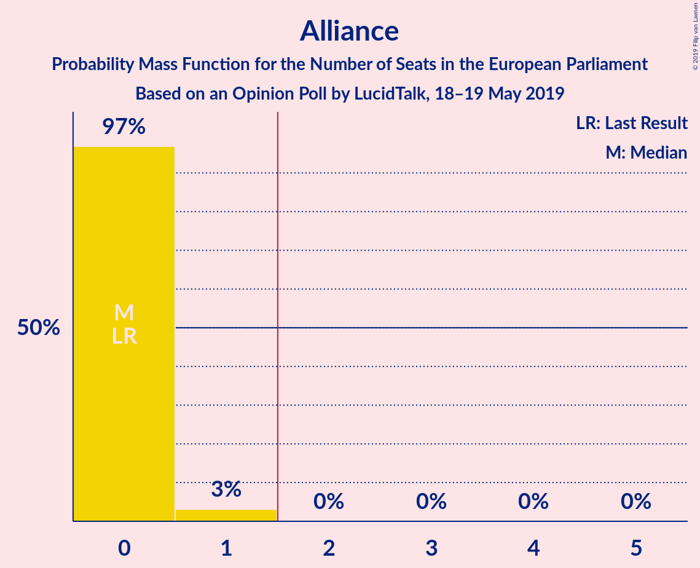

# Opinion Poll by LucidTalk, 18–19 May 2019

<a href="#voting-intentions">Voting Intentions</a> | <a href="#seats">Seats</a> | <a href="#coalitions">Coalitions</a> | <a href="#technical-information">Technical Information</a>

## Voting Intentions

### Confidence Intervals

| Party | Last Result | Poll Result | 80% Confidence Interval | 90% Confidence Interval | 95% Confidence Interval | 99% Confidence Interval |
|:-----:|:-----------:|:-----------:|:-----------------------:|:-----------------------:|:-----------------------:|:-----------------------:|
| Sinn Féin (GUE/NGL) | 25.5% | 25.9% | 24.5–27.4% |24.1–27.8% |23.7–28.2% |23.1–28.9% |
| Democratic Unionist Party (NI) | 20.9% | 21.5% | 20.2–22.9% |19.8–23.3% |19.5–23.7% |18.9–24.4% |
| Social Democratic and Labour Party (S&D) | 13.0% | 13.1% | 12.0–14.3% |11.7–14.6% |11.5–14.9% |11.0–15.5% |
| Ulster Unionist Party (ECR) | 13.3% | 11.6% | 10.6–12.7% |10.3–13.1% |10.1–13.3% |9.6–13.9% |
| Alliance Party of Northern Ireland (ALDE) | 7.1% | 11.5% | 10.5–12.6% |10.2–12.9% |9.9–13.2% |9.5–13.8% |
| Traditional Unionist Voice (*) | 12.1% | 9.2% | 8.3–10.2% |8.0–10.5% |7.8–10.8% |7.4–11.3% |

*Note:* The poll result column reflects the actual value used in the calculations. Published results may vary slightly, and in addition be rounded to fewer digits.

## Seats

### Confidence Intervals

| Party | Last Result | Median | 80% Confidence Interval | 90% Confidence Interval | 95% Confidence Interval | 99% Confidence Interval |
|:-----:|:-----------:|:------:|:-----------------------:|:-----------------------:|:-----------------------:|:-----------------------:|
| <a href="#sinn-féin-(gue/ngl)">Sinn Féin (GUE/NGL)</a> | 1 | 1 | 1 |1 |1 |1–2 |
| <a href="#democratic-unionist-party-(ni)">Democratic Unionist Party (NI)</a> | 1 | 1 | 1 |1 |1 |1 |
| <a href="#social-democratic-and-labour-party-(s&d)">Social Democratic and Labour Party (S&D)</a> | 0 | 0 | 0 |0 |0 |0–1 |
| <a href="#ulster-unionist-party-(ecr)">Ulster Unionist Party (ECR)</a> | 1 | 0 | 0 |0 |0 |0–1 |
| <a href="#alliance-party-of-northern-ireland-(alde)">Alliance Party of Northern Ireland (ALDE)</a> | 0 | 1 | 1 |1 |0–1 |0–1 |
| <a href="#traditional-unionist-voice-(*)">Traditional Unionist Voice (*)</a> | 0 | 0 | 0 |0 |0 |0 |

### Sinn Féin (GUE/NGL)

*For a full overview of the results for this party, see the [Sinn Féin (GUE/NGL)](party-sinnféinguengl.html) page.*

| Number of Seats | Probability | Accumulated | Special Marks |
|:---------------:|:-----------:|:-----------:|:-------------:|
| 1 | 99.2% | 100% | Last Result, Median |
| 2 | 0.8% | 0.8% | Majority |
| 3 | 0% | 0% |  |

### Democratic Unionist Party (NI)

*For a full overview of the results for this party, see the [Democratic Unionist Party (NI)](party-democraticunionistpartyni.html) page.*

| Number of Seats | Probability | Accumulated | Special Marks |
|:---------------:|:-----------:|:-----------:|:-------------:|
| 1 | 100% | 100% | Last Result, Median |

### Social Democratic and Labour Party (S&D)

*For a full overview of the results for this party, see the [Social Democratic and Labour Party (S&D)](party-socialdemocraticandlabourpartysd.html) page.*

| Number of Seats | Probability | Accumulated | Special Marks |
|:---------------:|:-----------:|:-----------:|:-------------:|
| 0 | 98% | 100% | Last Result, Median |
| 1 | 2% | 2% |  |
| 2 | 0% | 0% | Majority |

### Ulster Unionist Party (ECR)

*For a full overview of the results for this party, see the [Ulster Unionist Party (ECR)](party-ulsterunionistpartyecr.html) page.*

| Number of Seats | Probability | Accumulated | Special Marks |
|:---------------:|:-----------:|:-----------:|:-------------:|
| 0 | 99.1% | 100% | Median |
| 1 | 0.9% | 0.9% | Last Result |
| 2 | 0% | 0% | Majority |

### Alliance Party of Northern Ireland (ALDE)

*For a full overview of the results for this party, see the [Alliance Party of Northern Ireland (ALDE)](party-alliancepartyofnorthernirelandalde.html) page.*

| Number of Seats | Probability | Accumulated | Special Marks |
|:---------------:|:-----------:|:-----------:|:-------------:|
| 0 | 4% | 100% | Last Result |
| 1 | 96% | 96% | Median |
| 2 | 0% | 0% | Majority |

### Traditional Unionist Voice (*)

*For a full overview of the results for this party, see the [Traditional Unionist Voice (*)](party-traditionalunionistvoice.html) page.*

| Number of Seats | Probability | Accumulated | Special Marks |
|:---------------:|:-----------:|:-----------:|:-------------:|
| 0 | 100% | 100% | Last Result, Median |

## Coalitions

### Confidence Intervals

| Coalition | Last Result | Median | Majority? | 80% Confidence Interval | 90% Confidence Interval | 95% Confidence Interval | 99% Confidence Interval |
|:---------:|:-----------:|:------:|:---------:|:-----------------------:|:-----------------------:|:-----------------------:|:-----------------------:|
| Democratic Unionist Party (NI) | 1 | 1 | 0% | 1 | 1 | 1 | 1 |
| Sinn Féin (GUE/NGL) | 1 | 1 | 0.8% | 1 | 1 | 1 | 1–2 |
| Alliance Party of Northern Ireland (ALDE) | 0 | 1 | 0% | 1 | 1 | 0–1 | 0–1 |
| Social Democratic and Labour Party (S&D) | 0 | 0 | 0% | 0 | 0 | 0 | 0–1 |

### Democratic Unionist Party (NI)

| Number of Seats | Probability | Accumulated | Special Marks |
|:---------------:|:-----------:|:-----------:|:-------------:|
| 1 | 100% | 100% | Last Result, Median |

### Sinn Féin (GUE/NGL)

| Number of Seats | Probability | Accumulated | Special Marks |
|:---------------:|:-----------:|:-----------:|:-------------:|
| 1 | 99.2% | 100% | Last Result, Median |
| 2 | 0.8% | 0.8% | Majority |
| 3 | 0% | 0% |  |

### Alliance Party of Northern Ireland (ALDE)

| Number of Seats | Probability | Accumulated | Special Marks |
|:---------------:|:-----------:|:-----------:|:-------------:|
| 0 | 4% | 100% | Last Result |
| 1 | 96% | 96% | Median |
| 2 | 0% | 0% | Majority |

### Social Democratic and Labour Party (S&D)

| Number of Seats | Probability | Accumulated | Special Marks |
|:---------------:|:-----------:|:-----------:|:-------------:|
| 0 | 98% | 100% | Last Result, Median |
| 1 | 2% | 2% |  |
| 2 | 0% | 0% | Majority |

## Technical Information

### Opinion Poll

+ **Polling firm:** LucidTalk
+ **Commissioner(s):** —
+ **Fieldwork period:** 18–19 May 2019

### Calculations

+ **Sample size:** 1482
+ **Simulations done:** 1,024
+ **Error estimate:** 1.58%

