# Opinion Poll by LucidTalk, 9–12 August 2019

<a href="#voting-intentions">Voting Intentions</a> | <a href="#seats">Seats</a> | <a href="#coalitions">Coalitions</a> | <a href="#technical-information">Technical Information</a>

## Voting Intentions

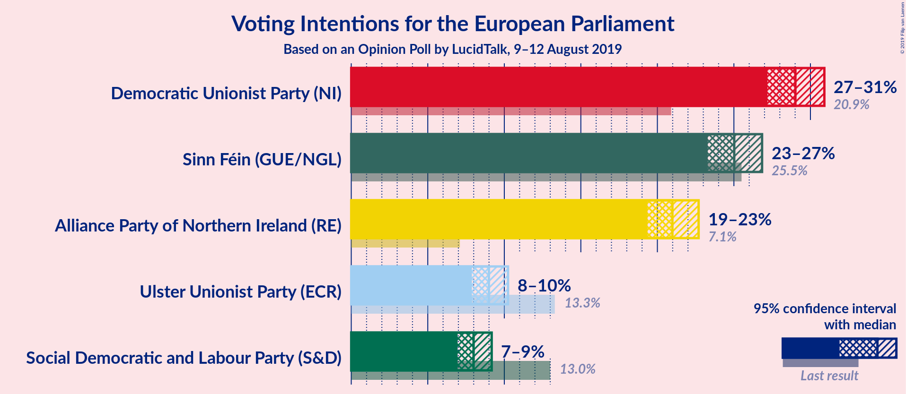

### Confidence Intervals

| Party | Last Result | Poll Result | 80% Confidence Interval | 90% Confidence Interval | 95% Confidence Interval | 99% Confidence Interval |
|:-----:|:-----------:|:-----------:|:-----------------------:|:-----------------------:|:-----------------------:|:-----------------------:|
| Democratic Unionist Party (NI) | 20.9% | 29.0% | 27.8–30.3% |27.5–30.6% |27.2–30.9% |26.6–31.5% |
| Sinn Féin (GUE/NGL) | 25.5% | 25.0% | 23.9–26.2% |23.6–26.6% |23.3–26.8% |22.8–27.4% |
| Alliance Party of Northern Ireland (RE) | 7.1% | 21.0% | 19.9–22.1% |19.6–22.4% |19.4–22.7% |18.9–23.2% |
| Ulster Unionist Party (ECR) | 13.3% | 9.0% | 8.3–9.8% |8.1–10.0% |7.9–10.2% |7.6–10.6% |
| Social Democratic and Labour Party (S&D) | 13.0% | 8.0% | 7.3–8.8% |7.1–9.0% |7.0–9.2% |6.6–9.6% |

*Note:* The poll result column reflects the actual value used in the calculations. Published results may vary slightly, and in addition be rounded to fewer digits.

## Seats

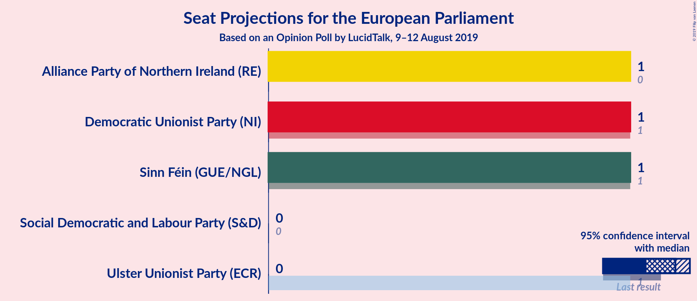

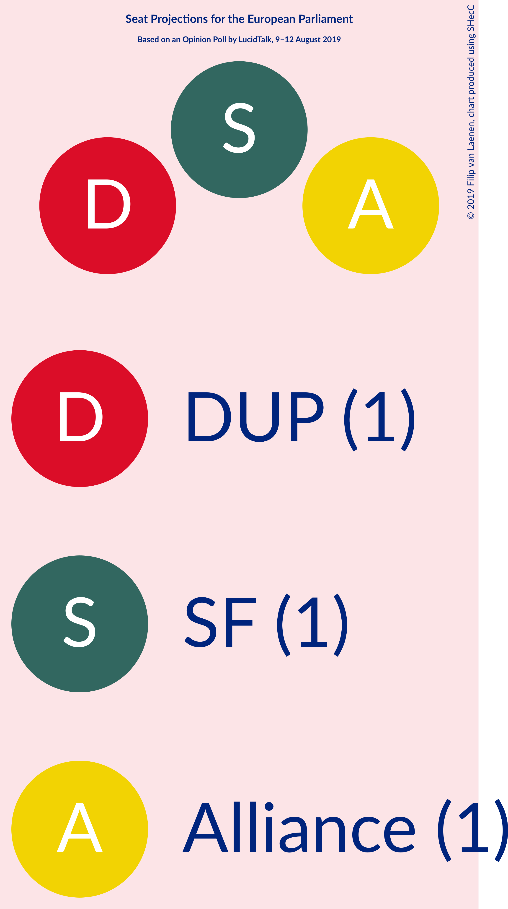

### Confidence Intervals

| Party | Last Result | Median | 80% Confidence Interval | 90% Confidence Interval | 95% Confidence Interval | 99% Confidence Interval |
|:-----:|:-----------:|:------:|:-----------------------:|:-----------------------:|:-----------------------:|:-----------------------:|
| <a href="#democratic-unionist-party-(ni)">Democratic Unionist Party (NI)</a> | 1 | 1 | 1 |1 |1 |1 |
| <a href="#sinn-féin-(gue/ngl)">Sinn Féin (GUE/NGL)</a> | 1 | 1 | 1 |1 |1 |1 |
| <a href="#alliance-party-of-northern-ireland-(re)">Alliance Party of Northern Ireland (RE)</a> | 0 | 1 | 1 |1 |1 |1 |
| <a href="#ulster-unionist-party-(ecr)">Ulster Unionist Party (ECR)</a> | 1 | 0 | 0 |0 |0 |0 |
| <a href="#social-democratic-and-labour-party-(s&d)">Social Democratic and Labour Party (S&D)</a> | 0 | 0 | 0 |0 |0 |0 |

### Democratic Unionist Party (NI)

*For a full overview of the results for this party, see the [Democratic Unionist Party (NI)](party-democraticunionistpartyni.html) page.*

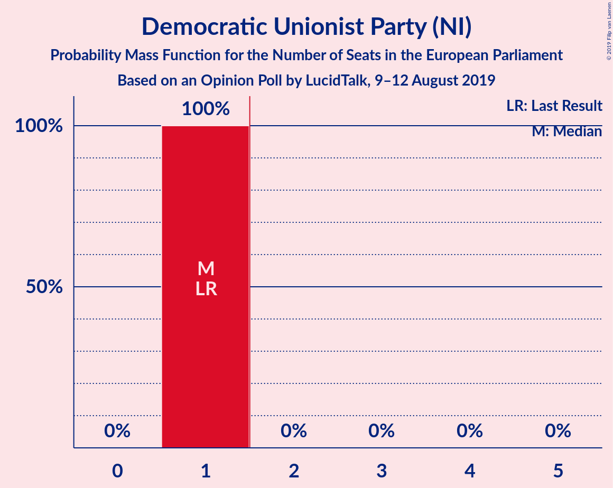

| Number of Seats | Probability | Accumulated | Special Marks |
|:---------------:|:-----------:|:-----------:|:-------------:|
| 1 | 100% | 100% | Last Result, Median |

### Sinn Féin (GUE/NGL)

*For a full overview of the results for this party, see the [Sinn Féin (GUE/NGL)](party-sinnféinguengl.html) page.*

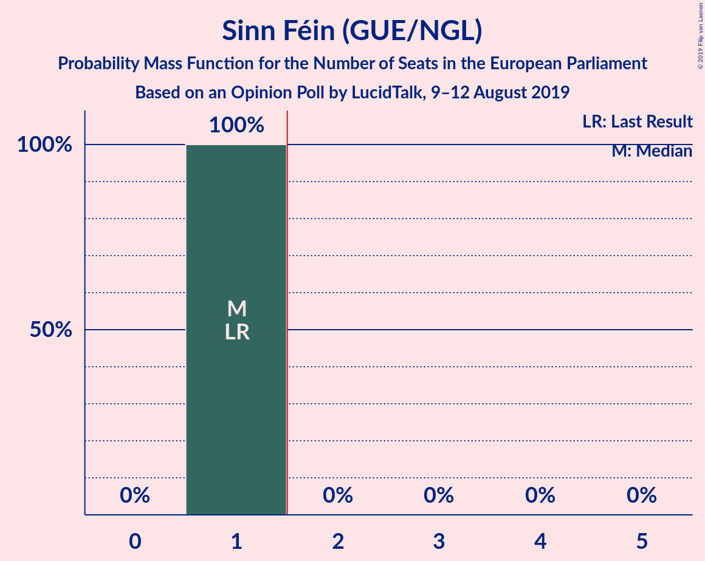

| Number of Seats | Probability | Accumulated | Special Marks |
|:---------------:|:-----------:|:-----------:|:-------------:|
| 1 | 100% | 100% | Last Result, Median |

### Alliance Party of Northern Ireland (RE)

*For a full overview of the results for this party, see the [Alliance Party of Northern Ireland (RE)](party-alliancepartyofnorthernirelandre.html) page.*

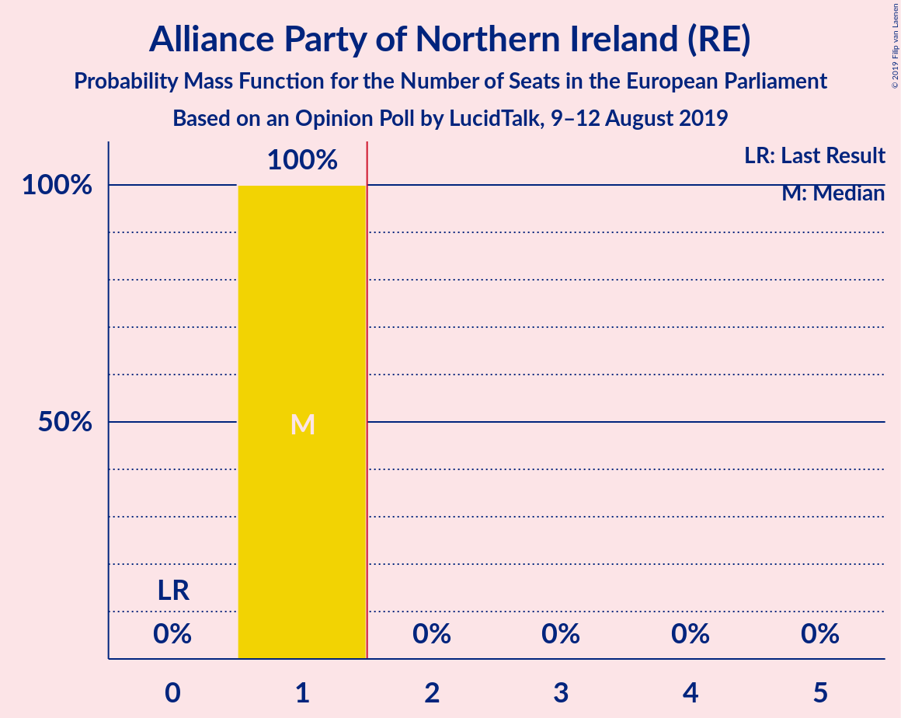

| Number of Seats | Probability | Accumulated | Special Marks |
|:---------------:|:-----------:|:-----------:|:-------------:|
| 0 | 0% | 100% | Last Result |
| 1 | 100% | 100% | Median |

### Ulster Unionist Party (ECR)

*For a full overview of the results for this party, see the [Ulster Unionist Party (ECR)](party-ulsterunionistpartyecr.html) page.*

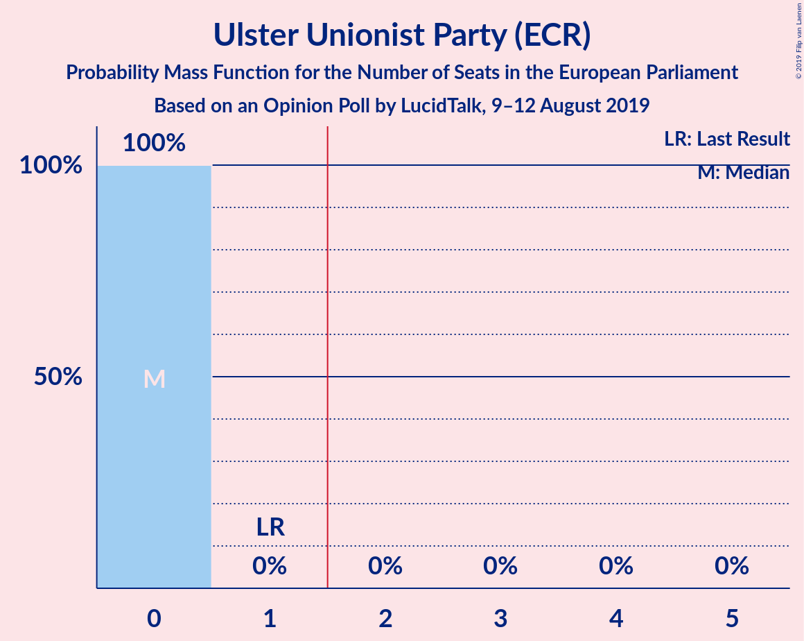

| Number of Seats | Probability | Accumulated | Special Marks |
|:---------------:|:-----------:|:-----------:|:-------------:|
| 0 | 100% | 100% | Median |
| 1 | 0% | 0% | Last Result |

### Social Democratic and Labour Party (S&D)

*For a full overview of the results for this party, see the [Social Democratic and Labour Party (S&D)](party-socialdemocraticandlabourpartysd.html) page.*

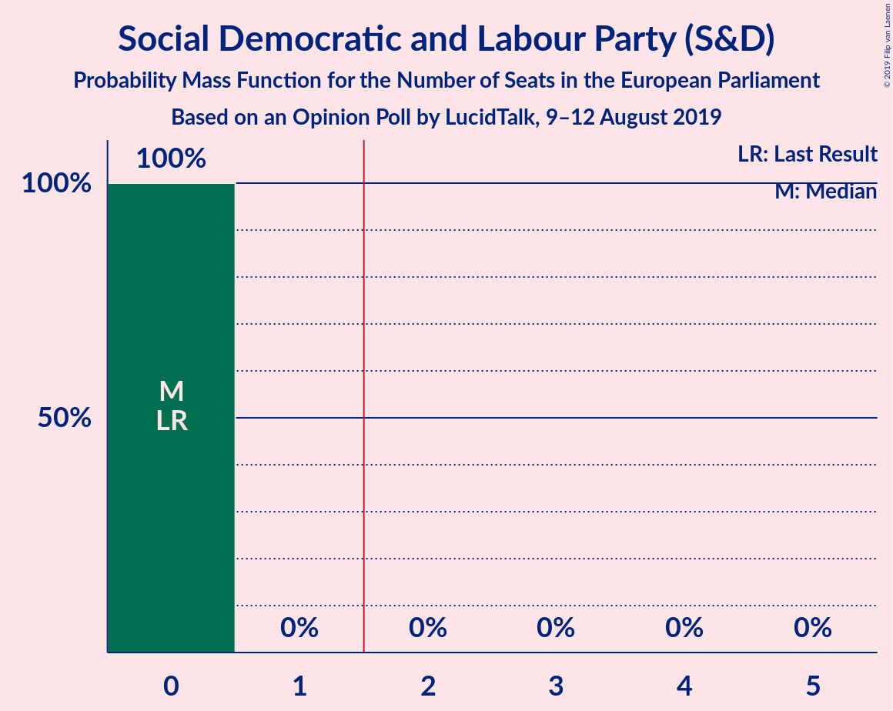

| Number of Seats | Probability | Accumulated | Special Marks |
|:---------------:|:-----------:|:-----------:|:-------------:|
| 0 | 100% | 100% | Last Result, Median |

## Coalitions

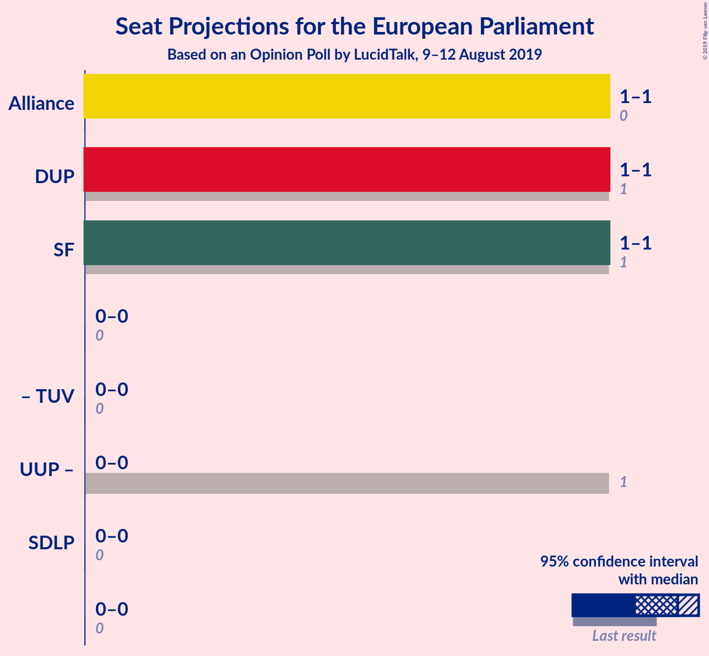

### Confidence Intervals

| Coalition | Last Result | Median | Majority? | 80% Confidence Interval | 90% Confidence Interval | 95% Confidence Interval | 99% Confidence Interval |
|:---------:|:-----------:|:------:|:---------:|:-----------------------:|:-----------------------:|:-----------------------:|:-----------------------:|
| Alliance Party of Northern Ireland (RE) | 0 | 1 | 0% | 1 | 1 | 1 | 1 |
| Democratic Unionist Party (NI) | 1 | 1 | 0% | 1 | 1 | 1 | 1 |
| Sinn Féin (GUE/NGL) | 1 | 1 | 0% | 1 | 1 | 1 | 1 |
| Social Democratic and Labour Party (S&D) | 0 | 0 | 0% | 0 | 0 | 0 | 0 |

### Alliance Party of Northern Ireland (RE)

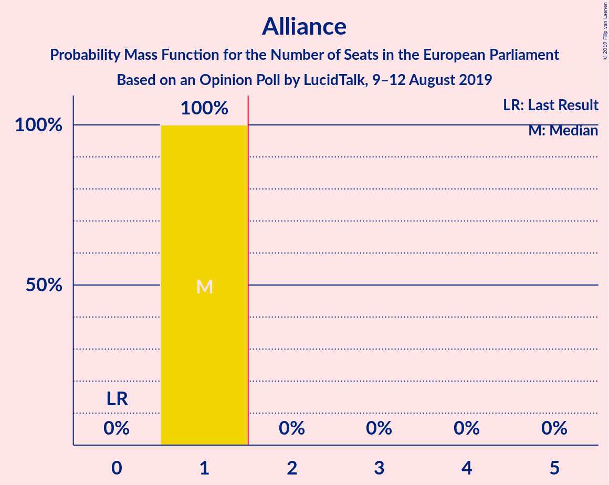

| Number of Seats | Probability | Accumulated | Special Marks |
|:---------------:|:-----------:|:-----------:|:-------------:|
| 0 | 0% | 100% | Last Result |
| 1 | 100% | 100% | Median |

### Democratic Unionist Party (NI)

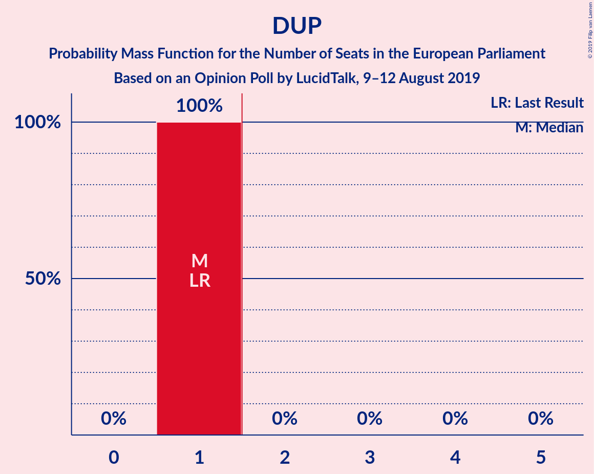

| Number of Seats | Probability | Accumulated | Special Marks |
|:---------------:|:-----------:|:-----------:|:-------------:|
| 1 | 100% | 100% | Last Result, Median |

### Sinn Féin (GUE/NGL)

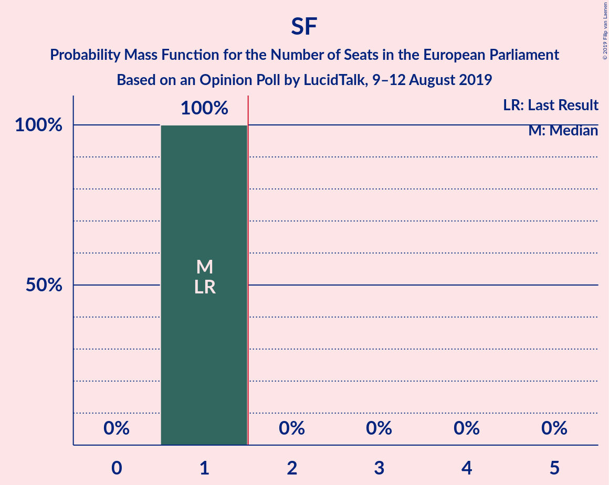

| Number of Seats | Probability | Accumulated | Special Marks |
|:---------------:|:-----------:|:-----------:|:-------------:|
| 1 | 100% | 100% | Last Result, Median |

### Social Democratic and Labour Party (S&D)

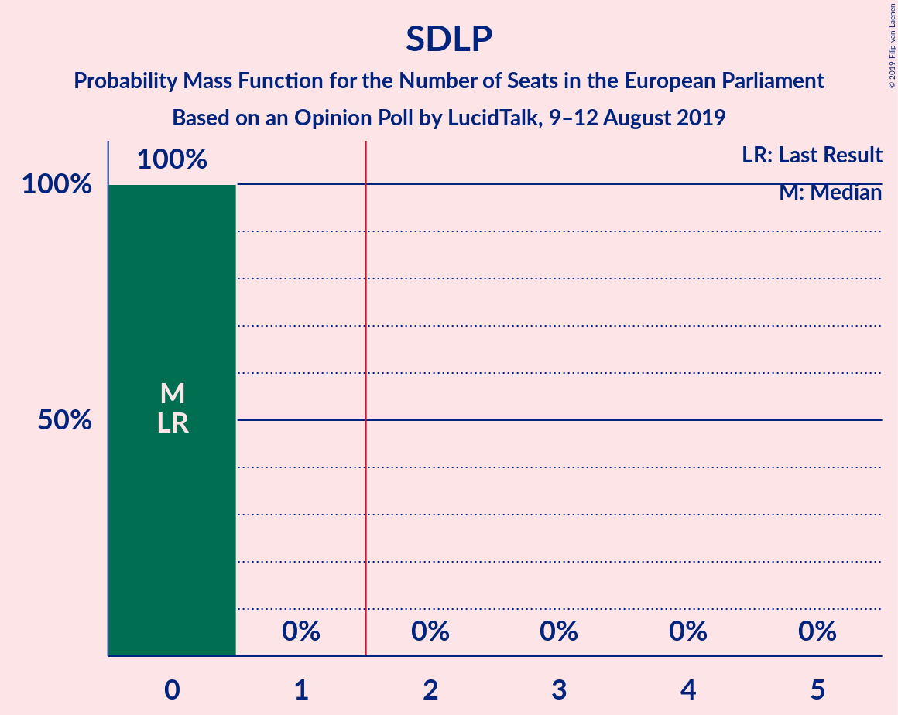

| Number of Seats | Probability | Accumulated | Special Marks |
|:---------------:|:-----------:|:-----------:|:-------------:|
| 0 | 100% | 100% | Last Result, Median |

## Technical Information

### Opinion Poll

+ **Polling firm:** LucidTalk
+ **Commissioner(s):** —
+ **Fieldwork period:** 9–12 August 2019

### Calculations

+ **Sample size:** 2302
+ **Simulations done:** 1,048,576
+ **Error estimate:** 3.28%

