# Opinion Poll by LucidTalk for Remain United, 27–30 November 2019

<a href="#voting-intentions">Voting Intentions</a> | <a href="#seats">Seats</a> | <a href="#coalitions">Coalitions</a> | <a href="#technical-information">Technical Information</a>

## Voting Intentions

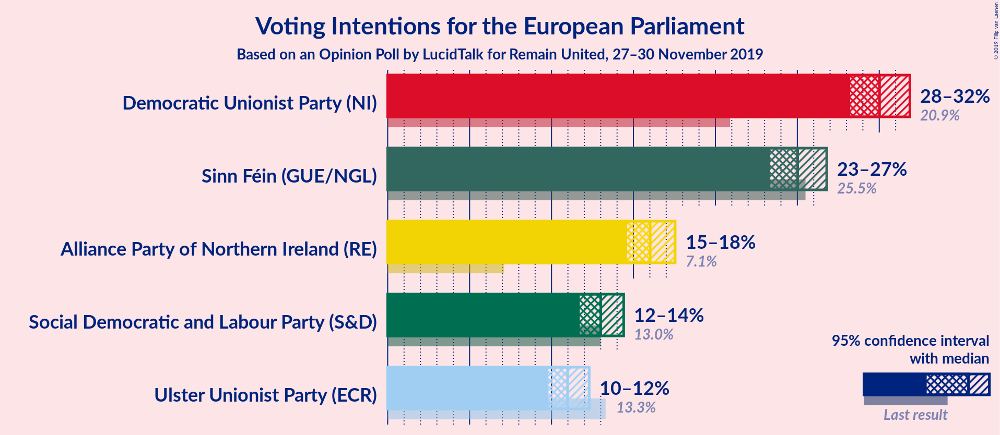

### Confidence Intervals

| Party | Last Result | Poll Result | 80% Confidence Interval | 90% Confidence Interval | 95% Confidence Interval | 99% Confidence Interval |
|:-----:|:-----------:|:-----------:|:-----------------------:|:-----------------------:|:-----------------------:|:-----------------------:|
| Democratic Unionist Party (NI) | 20.9% | 30.0% | 28.8–31.2% |28.5–31.6% |28.2–31.9% |27.7–32.5% |
| Sinn Féin (GUE/NGL) | 25.5% | 25.0% | 23.9–26.2% |23.6–26.5% |23.3–26.8% |22.8–27.3% |
| Alliance Party of Northern Ireland (RE) | 7.1% | 16.0% | 15.1–17.0% |14.8–17.3% |14.6–17.5% |14.2–18.0% |
| Social Democratic and Labour Party (S&D) | 13.0% | 13.0% | 12.2–13.9% |11.9–14.2% |11.7–14.4% |11.3–14.9% |
| Ulster Unionist Party (ECR) | 13.3% | 11.0% | 10.2–11.8% |10.0–12.1% |9.8–12.3% |9.4–12.7% |

*Note:* The poll result column reflects the actual value used in the calculations. Published results may vary slightly, and in addition be rounded to fewer digits.

## Seats

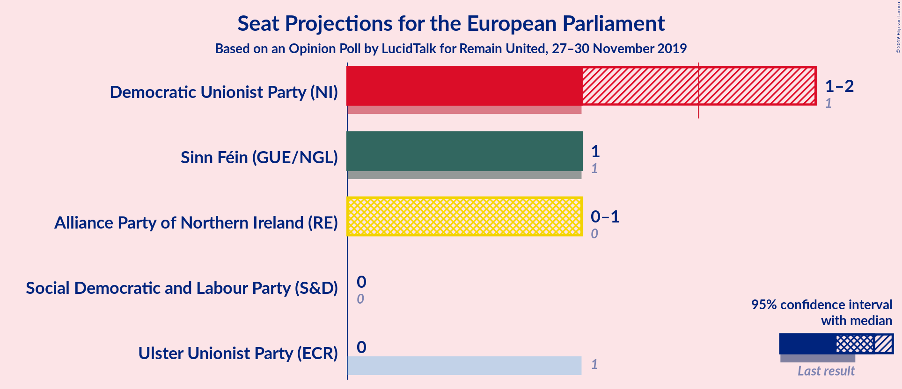

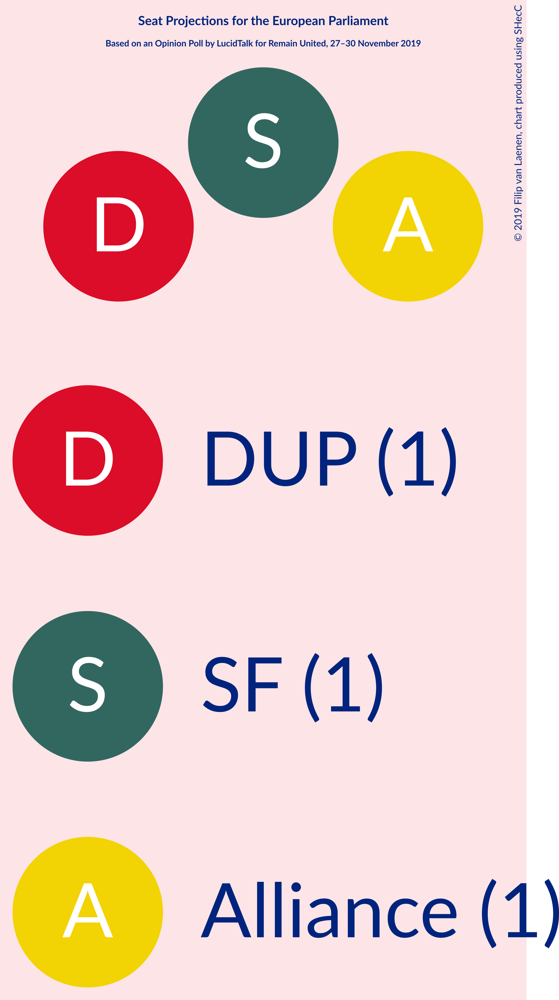

### Confidence Intervals

| Party | Last Result | Median | 80% Confidence Interval | 90% Confidence Interval | 95% Confidence Interval | 99% Confidence Interval |
|:-----:|:-----------:|:------:|:-----------------------:|:-----------------------:|:-----------------------:|:-----------------------:|
| <a href="#democratic-unionist-party-(ni)">Democratic Unionist Party (NI)</a> | 1 | 1 | 1–2 |1–2 |1–2 |1–2 |
| <a href="#sinn-féin-(gue/ngl)">Sinn Féin (GUE/NGL)</a> | 1 | 1 | 1 |1 |1 |1 |
| <a href="#alliance-party-of-northern-ireland-(re)">Alliance Party of Northern Ireland (RE)</a> | 0 | 1 | 0–1 |0–1 |0–1 |0–1 |
| <a href="#social-democratic-and-labour-party-(s&d)">Social Democratic and Labour Party (S&D)</a> | 0 | 0 | 0 |0 |0 |0 |
| <a href="#ulster-unionist-party-(ecr)">Ulster Unionist Party (ECR)</a> | 1 | 0 | 0 |0 |0 |0 |

### Democratic Unionist Party (NI)

*For a full overview of the results for this party, see the [Democratic Unionist Party (NI)](party-democraticunionistpartyni.html) page.*

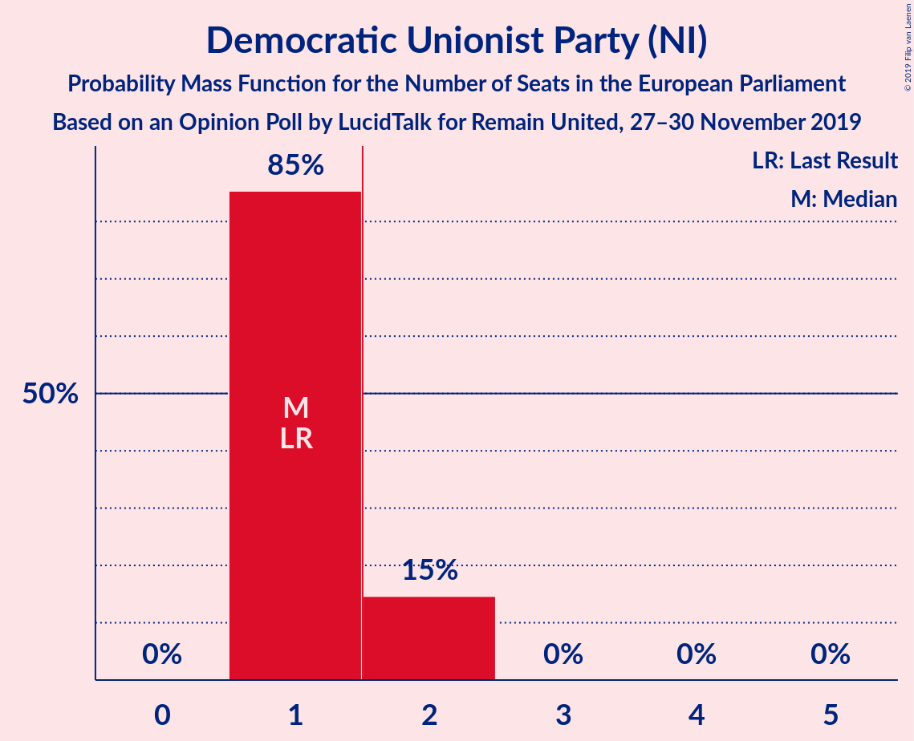

| Number of Seats | Probability | Accumulated | Special Marks |
|:---------------:|:-----------:|:-----------:|:-------------:|
| 1 | 85% | 100% | Last Result, Median |
| 2 | 15% | 15% | Majority |
| 3 | 0% | 0% |  |

### Sinn Féin (GUE/NGL)

*For a full overview of the results for this party, see the [Sinn Féin (GUE/NGL)](party-sinnféinguengl.html) page.*

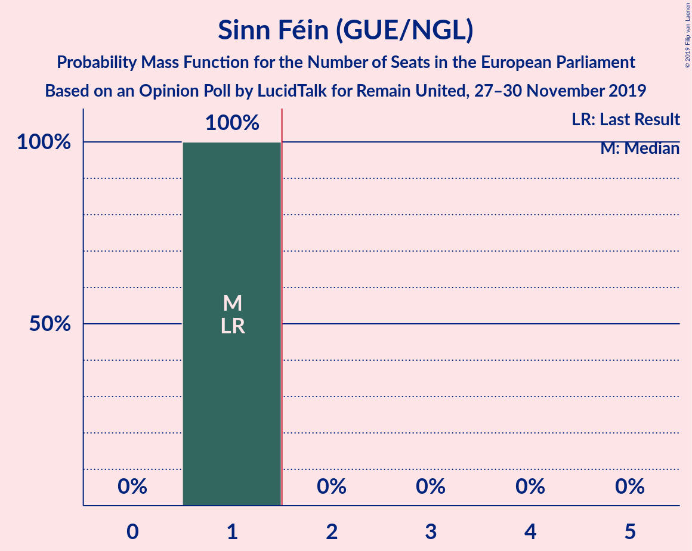

| Number of Seats | Probability | Accumulated | Special Marks |
|:---------------:|:-----------:|:-----------:|:-------------:|
| 1 | 100% | 100% | Last Result, Median |

### Alliance Party of Northern Ireland (RE)

*For a full overview of the results for this party, see the [Alliance Party of Northern Ireland (RE)](party-alliancepartyofnorthernirelandre.html) page.*

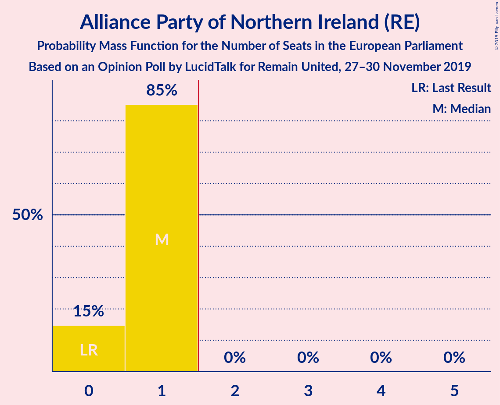

| Number of Seats | Probability | Accumulated | Special Marks |
|:---------------:|:-----------:|:-----------:|:-------------:|
| 0 | 15% | 100% | Last Result |
| 1 | 85% | 85% | Median |
| 2 | 0% | 0% | Majority |

### Social Democratic and Labour Party (S&D)

*For a full overview of the results for this party, see the [Social Democratic and Labour Party (S&D)](party-socialdemocraticandlabourpartysd.html) page.*

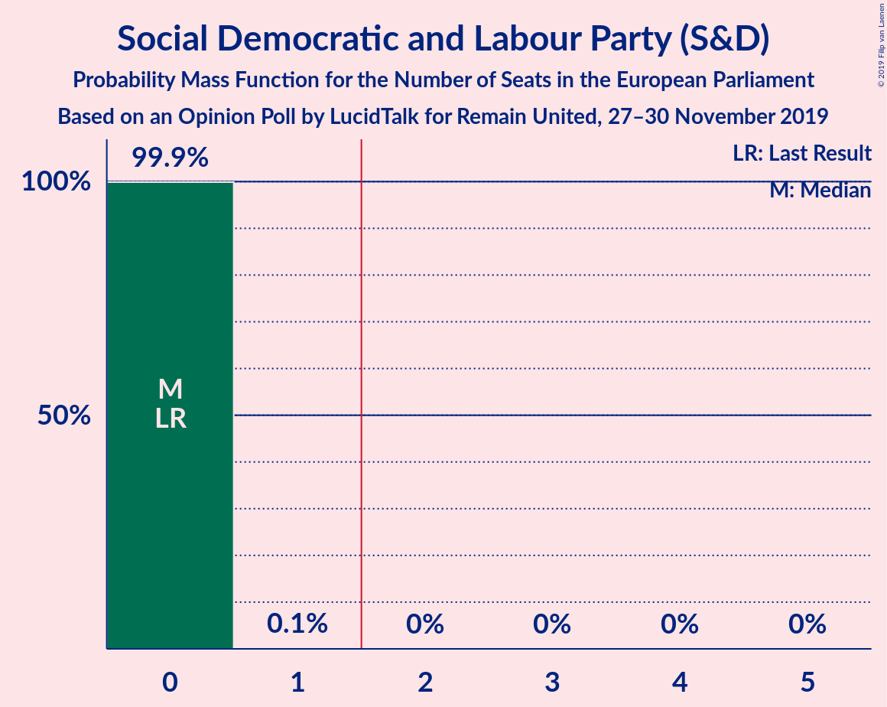

| Number of Seats | Probability | Accumulated | Special Marks |
|:---------------:|:-----------:|:-----------:|:-------------:|
| 0 | 99.9% | 100% | Last Result, Median |
| 1 | 0.1% | 0.1% |  |
| 2 | 0% | 0% | Majority |

### Ulster Unionist Party (ECR)

*For a full overview of the results for this party, see the [Ulster Unionist Party (ECR)](party-ulsterunionistpartyecr.html) page.*

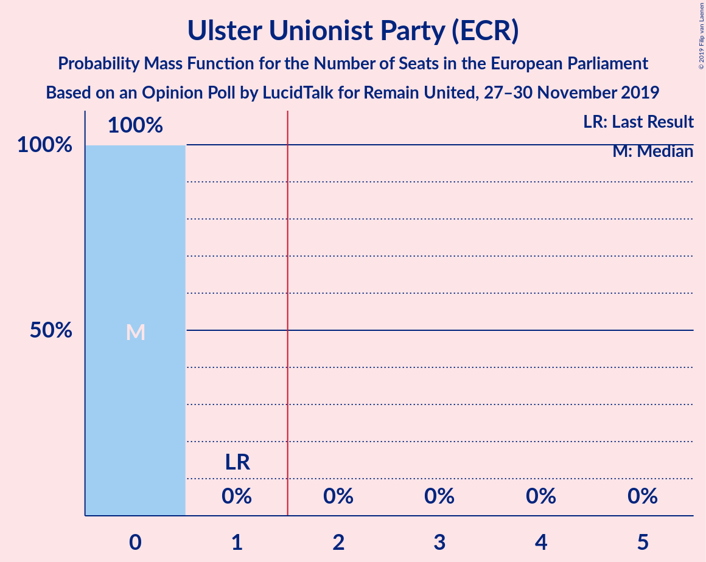

| Number of Seats | Probability | Accumulated | Special Marks |
|:---------------:|:-----------:|:-----------:|:-------------:|
| 0 | 100% | 100% | Median |
| 1 | 0% | 0% | Last Result |

## Coalitions

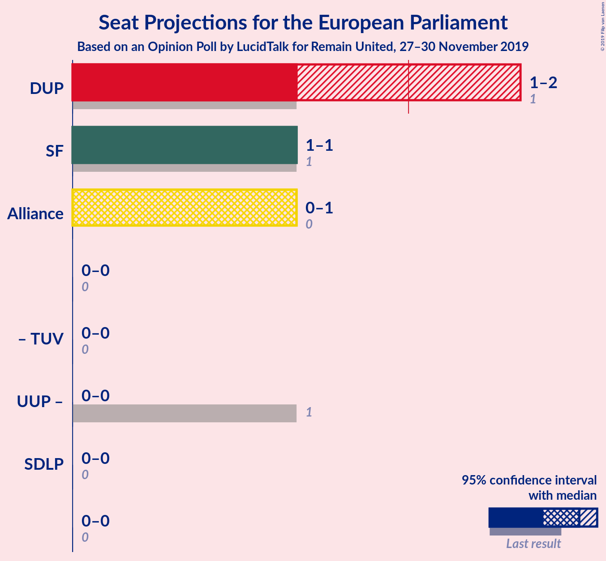

### Confidence Intervals

| Coalition | Last Result | Median | Majority? | 80% Confidence Interval | 90% Confidence Interval | 95% Confidence Interval | 99% Confidence Interval |
|:---------:|:-----------:|:------:|:---------:|:-----------------------:|:-----------------------:|:-----------------------:|:-----------------------:|
| Democratic Unionist Party (NI) | 1 | 1 | 15% | 1–2 | 1–2 | 1–2 | 1–2 |
| Sinn Féin (GUE/NGL) | 1 | 1 | 0% | 1 | 1 | 1 | 1 |
| Alliance Party of Northern Ireland (RE) | 0 | 1 | 0% | 0–1 | 0–1 | 0–1 | 0–1 |
| Social Democratic and Labour Party (S&D) | 0 | 0 | 0% | 0 | 0 | 0 | 0 |

### Democratic Unionist Party (NI)

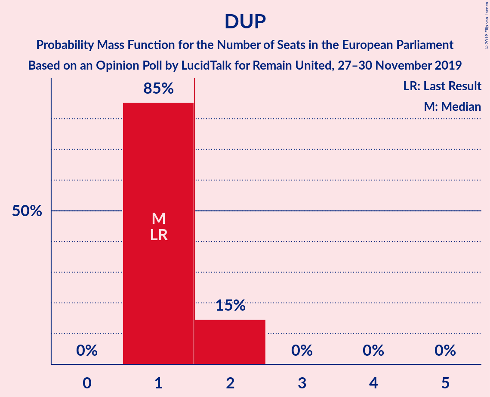

| Number of Seats | Probability | Accumulated | Special Marks |
|:---------------:|:-----------:|:-----------:|:-------------:|
| 1 | 85% | 100% | Last Result, Median |
| 2 | 15% | 15% | Majority |
| 3 | 0% | 0% |  |

### Sinn Féin (GUE/NGL)

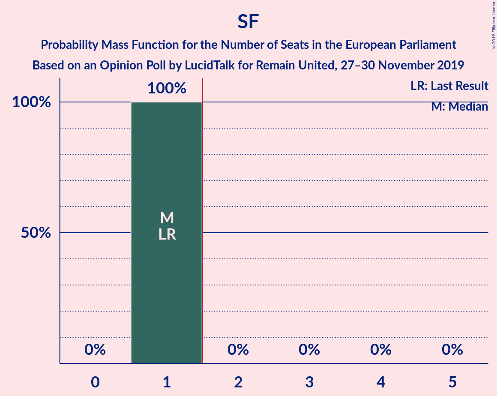

| Number of Seats | Probability | Accumulated | Special Marks |
|:---------------:|:-----------:|:-----------:|:-------------:|
| 1 | 100% | 100% | Last Result, Median |

### Alliance Party of Northern Ireland (RE)

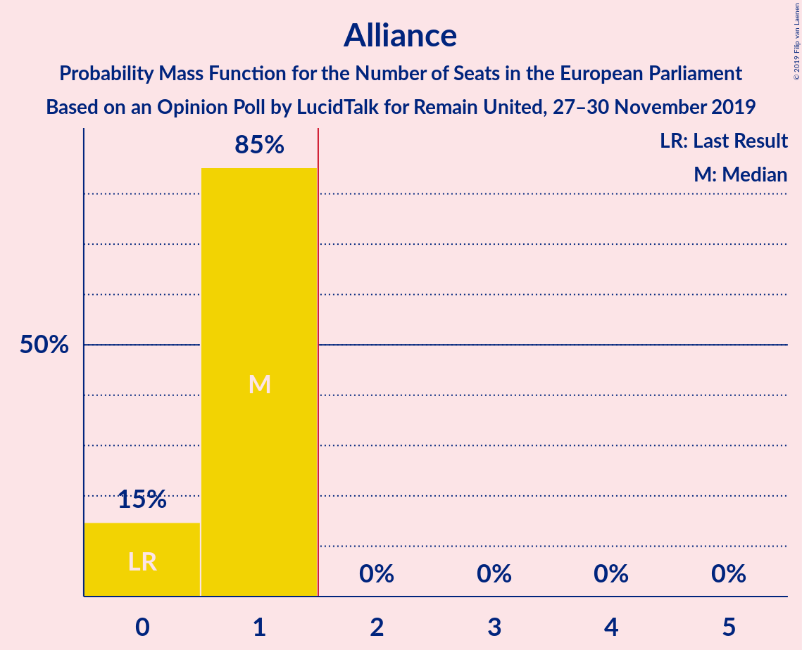

| Number of Seats | Probability | Accumulated | Special Marks |
|:---------------:|:-----------:|:-----------:|:-------------:|
| 0 | 15% | 100% | Last Result |
| 1 | 85% | 85% | Median |
| 2 | 0% | 0% | Majority |

### Social Democratic and Labour Party (S&D)

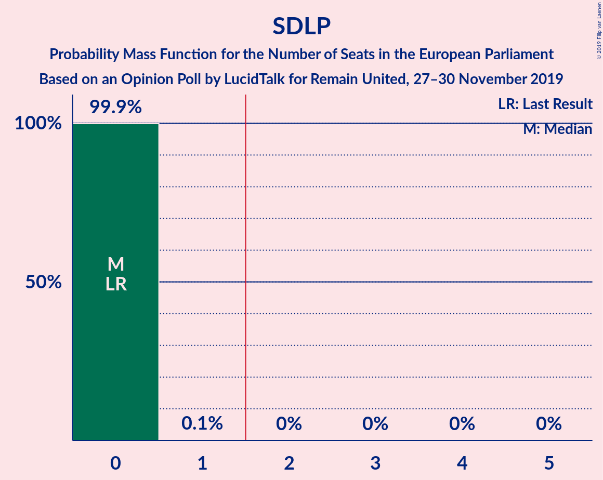

| Number of Seats | Probability | Accumulated | Special Marks |
|:---------------:|:-----------:|:-----------:|:-------------:|
| 0 | 99.9% | 100% | Last Result, Median |
| 1 | 0.1% | 0.1% |  |
| 2 | 0% | 0% | Majority |

## Technical Information

### Opinion Poll

+ **Polling firm:** LucidTalk
+ **Commissioner(s):** Remain United
+ **Fieldwork period:** 27–30 November 2019

### Calculations

+ **Sample size:** 2422
+ **Simulations done:** 1,048,576
+ **Error estimate:** 0.49%

