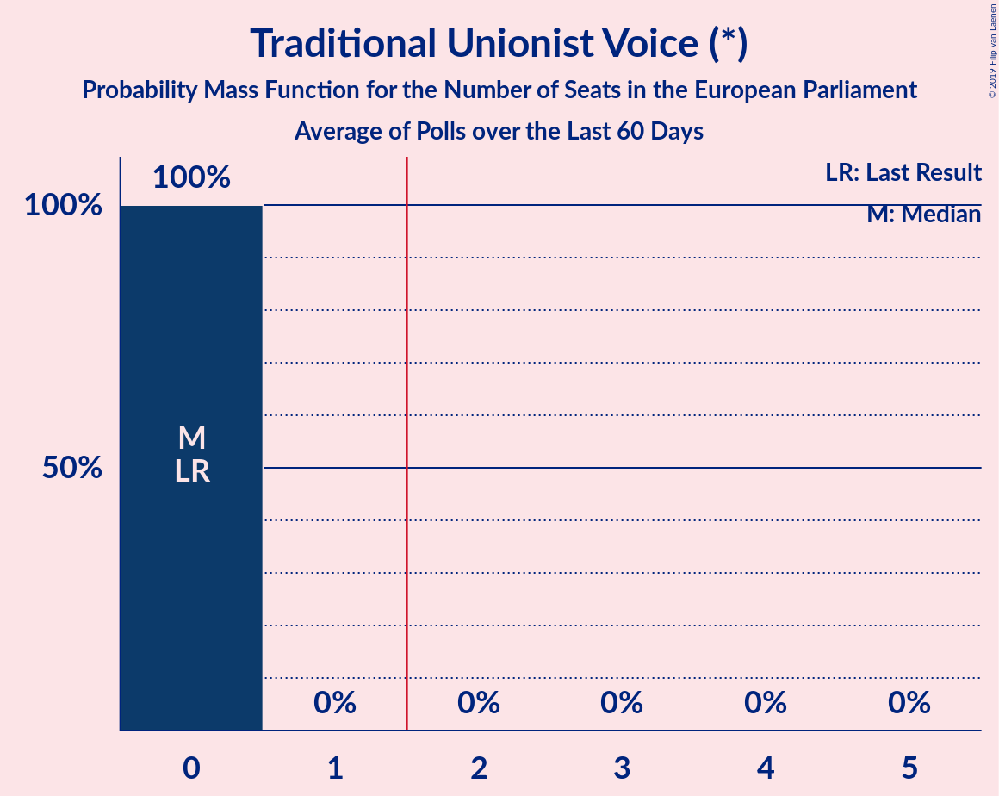

# Poll Average

<a href="#voting-intentions">Voting Intentions</a> | <a href="#seats">Seats</a> | <a href="#coalitions">Coalitions</a> | <a href="#technical-information">Technical Information</a>

## Summary

The table below lists the polls on which the average is based. They are the most recent polls (less than 60 days old) registered and analyzed so far.

| Period     | Polling firm/Commissioner(s) | SF | DUP | UUP | SDLP | TUV | Alliance |
|:----------:|:----------------------------:|:--:|:--:|:--:|:--:|:--:|:--:|
| 22 May 2014 | General Election | 25.5%   1 | 20.9%   1 | 13.3%   1 | 13.0%   0 | 12.1%   0 | 7.1%   0 |
| N/A | Poll Average | 24–28%   1 | 20–24%   1 | 10–13%   0 | 12–15%   0 | 8–11%   0 | 10–13%   0–1 |
| [18–19 May 2019](2019-05-19-LucidTalk.html) | LucidTalk | 24–28%   1 | 20–24%   1 | 10–13%   0 | 11–15%   0 | 8–11%   0 | 10–13%   0–1 |
| 22 May 2014 | General Election | 25.5%   1 | 20.9%   1 | 13.3%   1 | 13.0%   0 | 12.1%   0 | 7.1%   0 |

Only polls for which at least the sample size has been published are included in the table above.

**Legend:**
+ **Top half of each row:** Voting intentions (95% confidence interval)
+ **Bottom half of each row:** Seat projections for the European Parliament (95% confidence interval)
+ **SF:** Sinn Féin (GUE/NGL)
+ **DUP:** Democratic Unionist Party (NI)
+ **UUP:** Ulster Unionist Party (ECR)
+ **SDLP:** Social Democratic and Labour Party (S&D)
+ **TUV:** Traditional Unionist Voice (*)
+ **Alliance:** Alliance Party of Northern Ireland (ALDE)
+ **N/A (single party):** Party not included the published results
+ **N/A (entire row):** Calculation for this opinion poll not started yet

## Voting Intentions

### Confidence Intervals

| Party | Last Result | Median | 80% Confidence Interval | 90% Confidence Interval | 95% Confidence Interval | 99% Confidence Interval |
|:-----:|:-----------:|:------:|:-----------------------:|:-----------------------:|:-----------------------:|:-----------------------:|
| <a href="#sinn-féin-(gue/ngl)">Sinn Féin (GUE/NGL)</a> | 25.5% | 25.9% | 24.5–27.4% |24.1–27.8% | 23.8–28.2% | 23.1–28.9% |
| <a href="#democratic-unionist-party-(ni)">Democratic Unionist Party (NI)</a> | 20.9% | 21.5% | 20.2–22.9% |19.8–23.3% | 19.5–23.7% | 18.9–24.4% |
| <a href="#ulster-unionist-party-(ecr)">Ulster Unionist Party (ECR)</a> | 13.3% | 11.6% | 10.6–12.7% |10.3–13.1% | 10.1–13.3% | 9.6–13.9% |
| <a href="#social-democratic-and-labour-party-(s&d)">Social Democratic and Labour Party (S&D)</a> | 13.0% | 13.1% | 12.0–14.3% |11.7–14.6% | 11.5–14.9% | 11.0–15.5% |
| <a href="#traditional-unionist-voice-(*)">Traditional Unionist Voice (*)</a> | 12.1% | 9.2% | 8.3–10.2% |8.0–10.5% | 7.8–10.8% | 7.4–11.3% |
| <a href="#alliance-party-of-northern-ireland-(alde)">Alliance Party of Northern Ireland (ALDE)</a> | 7.1% | 11.5% | 10.5–12.6% |10.2–12.9% | 9.9–13.2% | 9.5–13.8% |

### Sinn Féin (GUE/NGL)

*For a full overview of the results for this party, see the [Sinn Féin (GUE/NGL)](party-sinnféinguengl.html) page.*

| Voting Intentions | Probability | Accumulated | Special Marks |
|:-----------------:|:-----------:|:-----------:|:-------------:|
| 20.5–21.5% | 0% | 100% |  |
| 21.5–22.5% | 0.1% | 100% |  |
| 22.5–23.5% | 1.5% | 99.9% |  |
| 23.5–24.5% | 9% | 98% |  |
| 24.5–25.5% | 26% | 89% |  |
| 25.5–26.5% | 34% | 63% | Last Result, Median |
| 26.5–27.5% | 22% | 29% |  |
| 27.5–28.5% | 7% | 8% |  |
| 28.5–29.5% | 1.1% | 1.2% |  |
| 29.5–30.5% | 0.1% | 0.1% |  |
| 30.5–31.5% | 0% | 0% |  |

### Democratic Unionist Party (NI)

*For a full overview of the results for this party, see the [Democratic Unionist Party (NI)](party-democraticunionistpartyni.html) page.*

| Voting Intentions | Probability | Accumulated | Special Marks |
|:-----------------:|:-----------:|:-----------:|:-------------:|
| 16.5–17.5% | 0% | 100% |  |
| 17.5–18.5% | 0.2% | 100% |  |
| 18.5–19.5% | 3% | 99.8% |  |
| 19.5–20.5% | 14% | 97% |  |
| 20.5–21.5% | 33% | 83% | Last Result |
| 21.5–22.5% | 32% | 50% | Median |
| 22.5–23.5% | 14% | 18% |  |
| 23.5–24.5% | 3% | 3% |  |
| 24.5–25.5% | 0.3% | 0.3% |  |
| 25.5–26.5% | 0% | 0% |  |

### Ulster Unionist Party (ECR)

*For a full overview of the results for this party, see the [Ulster Unionist Party (ECR)](party-ulsterunionistpartyecr.html) page.*

| Voting Intentions | Probability | Accumulated | Special Marks |
|:-----------------:|:-----------:|:-----------:|:-------------:|
| 7.5–8.5% | 0% | 100% |  |
| 8.5–9.5% | 0.4% | 100% |  |
| 9.5–10.5% | 8% | 99.6% |  |
| 10.5–11.5% | 37% | 91% |  |
| 11.5–12.5% | 40% | 54% | Median |
| 12.5–13.5% | 13% | 14% | Last Result |
| 13.5–14.5% | 1.4% | 1.4% |  |
| 14.5–15.5% | 0.1% | 0.1% |  |
| 15.5–16.5% | 0% | 0% |  |

### Social Democratic and Labour Party (S&D)

*For a full overview of the results for this party, see the [Social Democratic and Labour Party (S&D)](party-socialdemocraticandlabourpartysd.html) page.*

| Voting Intentions | Probability | Accumulated | Special Marks |
|:-----------------:|:-----------:|:-----------:|:-------------:|
| 8.5–9.5% | 0% | 100% |  |
| 9.5–10.5% | 0.1% | 100% |  |
| 10.5–11.5% | 3% | 99.9% |  |
| 11.5–12.5% | 22% | 97% |  |
| 12.5–13.5% | 43% | 75% | Last Result, Median |
| 13.5–14.5% | 26% | 31% |  |
| 14.5–15.5% | 5% | 6% |  |
| 15.5–16.5% | 0.4% | 0.4% |  |
| 16.5–17.5% | 0% | 0% |  |

### Traditional Unionist Voice (*)

*For a full overview of the results for this party, see the [Traditional Unionist Voice (*)](party-traditionalunionistvoice.html) page.*

| Voting Intentions | Probability | Accumulated | Special Marks |
|:-----------------:|:-----------:|:-----------:|:-------------:|
| 5.5–6.5% | 0% | 100% |  |
| 6.5–7.5% | 0.9% | 100% |  |
| 7.5–8.5% | 17% | 99.1% |  |
| 8.5–9.5% | 49% | 82% | Median |
| 9.5–10.5% | 28% | 33% |  |
| 10.5–11.5% | 4% | 4% |  |
| 11.5–12.5% | 0.2% | 0.2% | Last Result |
| 12.5–13.5% | 0% | 0% |  |

### Alliance Party of Northern Ireland (ALDE)

*For a full overview of the results for this party, see the [Alliance Party of Northern Ireland (ALDE)](party-alliancepartyofnorthernirelandalde.html) page.*

| Voting Intentions | Probability | Accumulated | Special Marks |
|:-----------------:|:-----------:|:-----------:|:-------------:|
| 6.5–7.5% | 0% | 100% | Last Result |
| 7.5–8.5% | 0% | 100% |  |
| 8.5–9.5% | 0.6% | 100% |  |
| 9.5–10.5% | 11% | 99.4% |  |
| 10.5–11.5% | 41% | 88% | Median |
| 11.5–12.5% | 37% | 48% |  |
| 12.5–13.5% | 10% | 11% |  |
| 13.5–14.5% | 0.9% | 0.9% |  |
| 14.5–15.5% | 0% | 0% |  |

## Seats

### Confidence Intervals

| Party | Last Result | Median | 80% Confidence Interval | 90% Confidence Interval | 95% Confidence Interval | 99% Confidence Interval |
|:-----:|:-----------:|:------:|:-----------------------:|:-----------------------:|:-----------------------:|:-----------------------:|
| <a href="#sinn-féin-(gue/ngl)">Sinn Féin (GUE/NGL)</a> | 1 | 1 | 1 |1 | 1 | 1–2 |
| <a href="#democratic-unionist-party-(ni)">Democratic Unionist Party (NI)</a> | 1 | 1 | 1 |1 | 1 | 1 |
| <a href="#ulster-unionist-party-(ecr)">Ulster Unionist Party (ECR)</a> | 1 | 0 | 0 |0 | 0 | 0–1 |
| <a href="#social-democratic-and-labour-party-(s&d)">Social Democratic and Labour Party (S&D)</a> | 0 | 0 | 0 |0 | 0 | 0–1 |
| <a href="#traditional-unionist-voice-(*)">Traditional Unionist Voice (*)</a> | 0 | 0 | 0 |0 | 0 | 0 |
| <a href="#alliance-party-of-northern-ireland-(alde)">Alliance Party of Northern Ireland (ALDE)</a> | 0 | 1 | 1 |1 | 0–1 | 0–1 |

### Sinn Féin (GUE/NGL)

*For a full overview of the results for this party, see the [Sinn Féin (GUE/NGL)](party-sinnféinguengl.html) page.*

| Number of Seats | Probability | Accumulated | Special Marks |
|:---------------:|:-----------:|:-----------:|:-------------:|
| 1 | 99.2% | 100% | Last Result, Median |
| 2 | 0.8% | 0.8% | Majority |
| 3 | 0% | 0% |  |

### Democratic Unionist Party (NI)

*For a full overview of the results for this party, see the [Democratic Unionist Party (NI)](party-democraticunionistpartyni.html) page.*

| Number of Seats | Probability | Accumulated | Special Marks |
|:---------------:|:-----------:|:-----------:|:-------------:|
| 1 | 100% | 100% | Last Result, Median |

### Ulster Unionist Party (ECR)

*For a full overview of the results for this party, see the [Ulster Unionist Party (ECR)](party-ulsterunionistpartyecr.html) page.*

| Number of Seats | Probability | Accumulated | Special Marks |
|:---------------:|:-----------:|:-----------:|:-------------:|
| 0 | 99.1% | 100% | Median |
| 1 | 0.9% | 0.9% | Last Result |
| 2 | 0% | 0% | Majority |

### Social Democratic and Labour Party (S&D)

*For a full overview of the results for this party, see the [Social Democratic and Labour Party (S&D)](party-socialdemocraticandlabourpartysd.html) page.*

| Number of Seats | Probability | Accumulated | Special Marks |
|:---------------:|:-----------:|:-----------:|:-------------:|
| 0 | 98% | 100% | Last Result, Median |
| 1 | 2% | 2% |  |
| 2 | 0% | 0% | Majority |

### Traditional Unionist Voice (*)

*For a full overview of the results for this party, see the [Traditional Unionist Voice (*)](party-traditionalunionistvoice.html) page.*

| Number of Seats | Probability | Accumulated | Special Marks |
|:---------------:|:-----------:|:-----------:|:-------------:|
| 0 | 100% | 100% | Last Result, Median |

### Alliance Party of Northern Ireland (ALDE)

*For a full overview of the results for this party, see the [Alliance Party of Northern Ireland (ALDE)](party-alliancepartyofnorthernirelandalde.html) page.*

| Number of Seats | Probability | Accumulated | Special Marks |
|:---------------:|:-----------:|:-----------:|:-------------:|
| 0 | 4% | 100% | Last Result |
| 1 | 96% | 96% | Median |
| 2 | 0% | 0% | Majority |

## Coalitions

### Confidence Intervals

| Coalition | Last Result | Median | Majority? | 80% Confidence Interval | 90% Confidence Interval | 95% Confidence Interval | 99% Confidence Interval |
|:---------:|:-----------:|:------:|:---------:|:-----------------------:|:-----------------------:|:-----------------------:|:-----------------------:|
| Democratic Unionist Party (NI) | 1 | 1 | 0% | 1 | 1 | 1 | 1 |
| Sinn Féin (GUE/NGL) | 1 | 1 | 0.8% | 1 | 1 | 1 | 1–2 |
| Alliance Party of Northern Ireland (ALDE) | 0 | 1 | 0% | 1 | 1 | 0–1 | 0–1 |
| Social Democratic and Labour Party (S&D) | 0 | 0 | 0% | 0 | 0 | 0 | 0–1 |

### Democratic Unionist Party (NI)

| Number of Seats | Probability | Accumulated | Special Marks |
|:---------------:|:-----------:|:-----------:|:-------------:|
| 1 | 100% | 100% | Last Result, Median |

### Sinn Féin (GUE/NGL)

| Number of Seats | Probability | Accumulated | Special Marks |
|:---------------:|:-----------:|:-----------:|:-------------:|
| 1 | 99.2% | 100% | Last Result, Median |
| 2 | 0.8% | 0.8% | Majority |
| 3 | 0% | 0% |  |

### Alliance Party of Northern Ireland (ALDE)

| Number of Seats | Probability | Accumulated | Special Marks |
|:---------------:|:-----------:|:-----------:|:-------------:|
| 0 | 4% | 100% | Last Result |
| 1 | 96% | 96% | Median |
| 2 | 0% | 0% | Majority |

### Social Democratic and Labour Party (S&D)

| Number of Seats | Probability | Accumulated | Special Marks |
|:---------------:|:-----------:|:-----------:|:-------------:|
| 0 | 98% | 100% | Last Result, Median |
| 1 | 2% | 2% |  |
| 2 | 0% | 0% | Majority |

## Technical Information

+ **Number of polls included in this average:** 1
+ **Lowest number of simulations done in a poll included in this average:** 1,024
+ **Total number of simulations done in the polls included in this average:** 1,024
+ **Error estimate:** 1.58%
