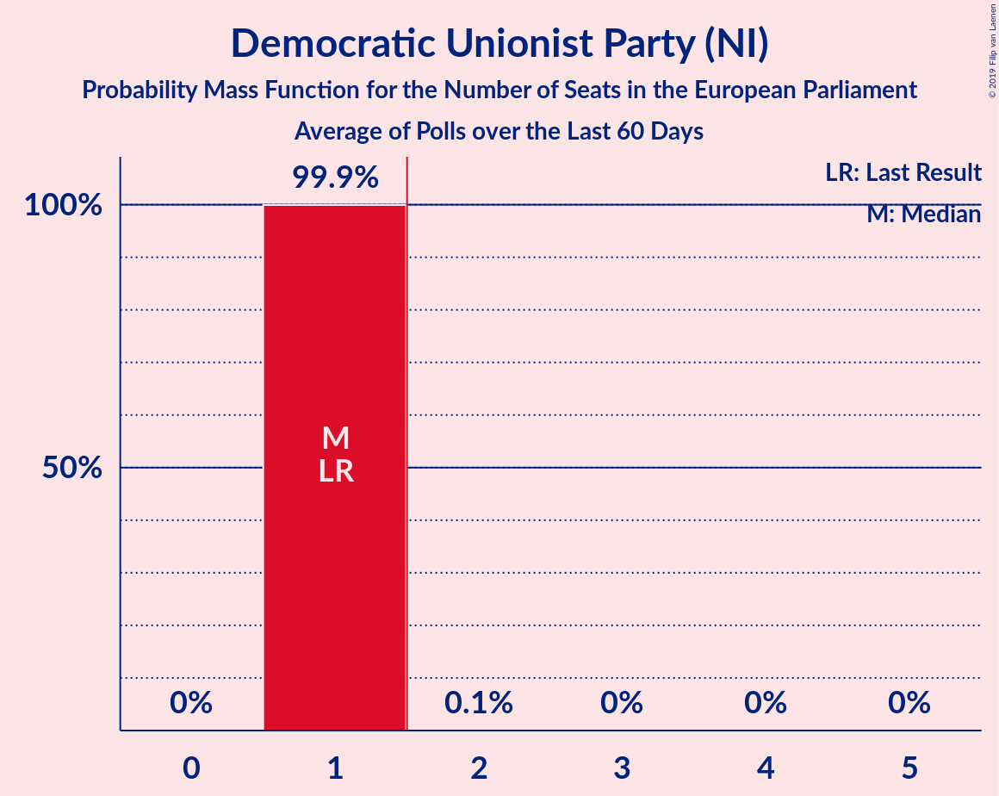

# Democratic Unionist Party (NI)

<a href="#voting-intentions">Voting Intentions</a> | <a href="#seats">Seats</a>

## Voting Intentions

Last result: **20.9%** (General Election of 22 May 2014)

### Confidence Intervals

| Period     | Polling firm/Commissioner(s) | Median | 80% Confidence Interval | 90% Confidence Interval | 95% Confidence Interval | 99% Confidence Interval |
|:----------:|:----------------:|:-----------:|:-----------------------:|:-----------------------:|:-----------------------:|:-----------------------:|
| N/A | [Poll Average](average.html) | 21.5% | 20.2–22.9% | 19.8–23.3% | 19.5–23.7% | 18.9–24.4% |
| [18–19 May 2019](2019-05-19-LucidTalk.html) | LucidTalk | 21.5% | 20.2–22.9% | 19.8–23.3% | 19.5–23.7% | 18.9–24.4% |
| [4–7 May 2019](2019-05-07-LucidTalk.html) | LucidTalk | 20.2% | 18.9–21.6% | 18.5–22.1% | 18.2–22.4% | 17.6–23.1% |
| [20 October–2 November 2018](2018-11-02-Survation.html) | Survation | 31.0% | 28.6–33.6% | 27.9–34.3% | 27.3–35.0% | 26.1–36.2% |

### Probability Mass Function

The following table shows the probability mass function per percentage block of voting intentions for the [poll average](average.html) for Democratic Unionist Party (NI).

| Voting Intentions | Probability | Accumulated | Special Marks |
|:-----------------:|:-----------:|:-----------:|:-------------:|
| 16.5–17.5% | 0% | 100% |  |
| 17.5–18.5% | 0.2% | 100% |  |
| 18.5–19.5% | 3% | 99.8% |  |
| 19.5–20.5% | 14% | 97% |  |
| 20.5–21.5% | 33% | 83% | Last Result |
| 21.5–22.5% | 32% | 50% | Median |
| 22.5–23.5% | 14% | 18% |  |
| 23.5–24.5% | 3% | 3% |  |
| 24.5–25.5% | 0.3% | 0.3% |  |
| 25.5–26.5% | 0% | 0% |  |

## Seats

Last result: **1** seats (General Election of 22 May 2014)

### Confidence Intervals

| Period     | Polling firm/Commissioner(s) | Median | 80% Confidence Interval | 90% Confidence Interval | 95% Confidence Interval | 99% Confidence Interval |
|:----------:|:----------------:|:------:|:-----------------------:|:-----------------------:|:-----------------------:|:-----------------------:|
| N/A | [Poll Average](average.html) | 1 | 1 | 1 | 1 | 1 |
| [18–19 May 2019](2019-05-19-LucidTalk.html) | LucidTalk | 1 | 1 | 1 | 1 | 1 |
| [4–7 May 2019](2019-05-07-LucidTalk.html) | LucidTalk | 1 | 1 | 1 | 1 | 1 |
| [20 October–2 November 2018](2018-11-02-Survation.html) | Survation | 2 | 1–2 | 1–2 | 1–2 | 1–2 |

### Probability Mass Function

The following table shows the probability mass function per seat for the [poll average](average.html) for Democratic Unionist Party (NI).

| Number of Seats | Probability | Accumulated | Special Marks |
|:---------------:|:-----------:|:-----------:|:-------------:|
| 1 | 99.9% | 100% | Last Result, Median |
| 2 | 0.1% | 0.1% | Majority |
| 3 | 0% | 0% |  |

