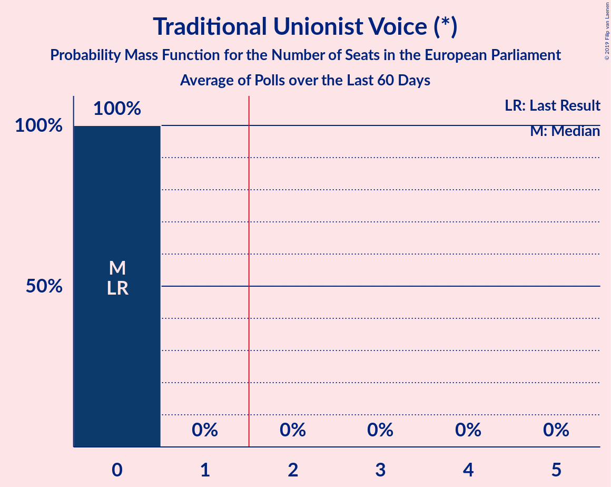

# Traditional Unionist Voice (*)

<a href="#voting-intentions">Voting Intentions</a> | <a href="#seats">Seats</a>

## Voting Intentions

Last result: **12.1%** (General Election of 22 May 2014)

### Confidence Intervals

| Period     | Polling firm/Commissioner(s) | Median | 80% Confidence Interval | 90% Confidence Interval | 95% Confidence Interval | 99% Confidence Interval |
|:----------:|:----------------:|:-----------:|:-----------------------:|:-----------------------:|:-----------------------:|:-----------------------:|
| N/A | [Poll Average](average.html) | 9.2% | 8.3–10.2% | 8.0–10.5% | 7.8–10.8% | 7.4–11.3% |
| [18–19 May 2019](2019-05-19-LucidTalk.html) | LucidTalk | 9.2% | 8.3–10.2% | 8.0–10.5% | 7.8–10.8% | 7.4–11.3% |
| [4–7 May 2019](2019-05-07-LucidTalk.html) | LucidTalk | 8.5% | 7.6–9.5% | 7.3–9.8% | 7.1–10.0% | 6.7–10.6% |
| [20 October–2 November 2018](2018-11-02-Survation.html) | Survation | 0.0% | N/A | N/A | N/A | N/A |

### Probability Mass Function

The following table shows the probability mass function per percentage block of voting intentions for the [poll average](average.html) for Traditional Unionist Voice (*).

| Voting Intentions | Probability | Accumulated | Special Marks |
|:-----------------:|:-----------:|:-----------:|:-------------:|
| 5.5–6.5% | 0% | 100% |  |
| 6.5–7.5% | 0.9% | 100% |  |
| 7.5–8.5% | 17% | 99.1% |  |
| 8.5–9.5% | 49% | 82% | Median |
| 9.5–10.5% | 28% | 33% |  |
| 10.5–11.5% | 4% | 4% |  |
| 11.5–12.5% | 0.2% | 0.2% | Last Result |
| 12.5–13.5% | 0% | 0% |  |

## Seats

Last result: **0** seats (General Election of 22 May 2014)

### Confidence Intervals

| Period     | Polling firm/Commissioner(s) | Median | 80% Confidence Interval | 90% Confidence Interval | 95% Confidence Interval | 99% Confidence Interval |
|:----------:|:----------------:|:------:|:-----------------------:|:-----------------------:|:-----------------------:|:-----------------------:|
| N/A | [Poll Average](average.html) | 0 | 0 | 0 | 0 | 0 |
| [18–19 May 2019](2019-05-19-LucidTalk.html) | LucidTalk | 0 | 0 | 0 | 0 | 0 |
| [4–7 May 2019](2019-05-07-LucidTalk.html) | LucidTalk | 0 | 0 | 0 | 0 | 0 |
| [20 October–2 November 2018](2018-11-02-Survation.html) | Survation |  |  |  |  |  |

### Probability Mass Function

The following table shows the probability mass function per seat for the [poll average](average.html) for Traditional Unionist Voice (*).

| Number of Seats | Probability | Accumulated | Special Marks |
|:---------------:|:-----------:|:-----------:|:-------------:|
| 0 | 100% | 100% | Last Result, Median |

