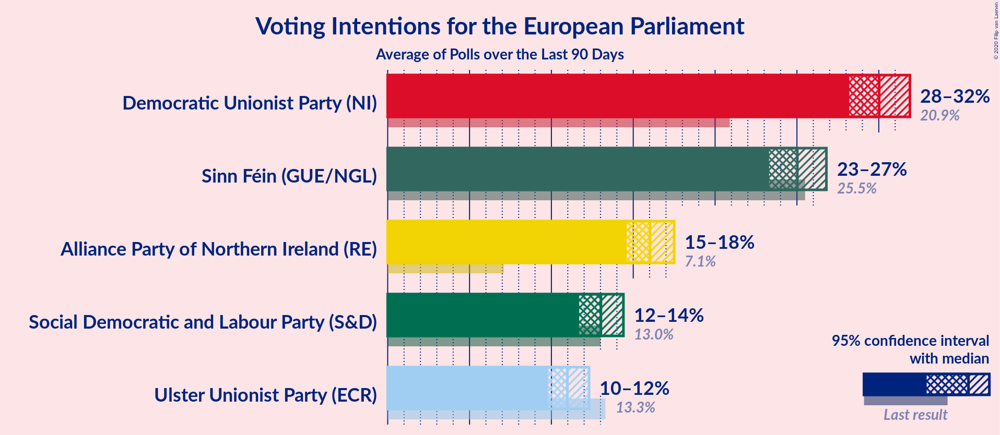
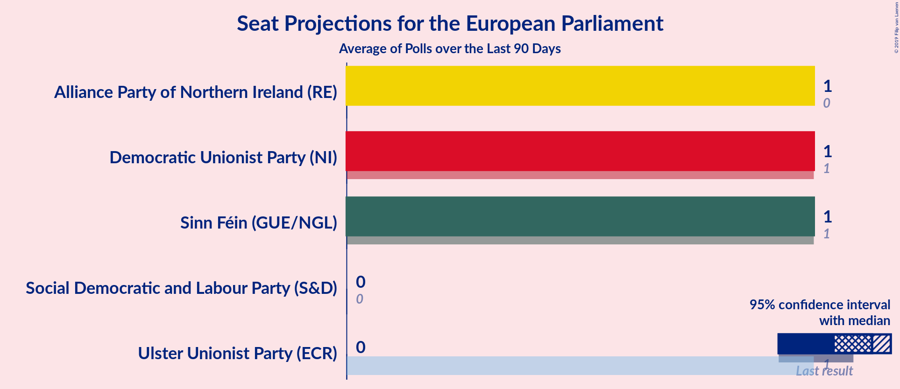
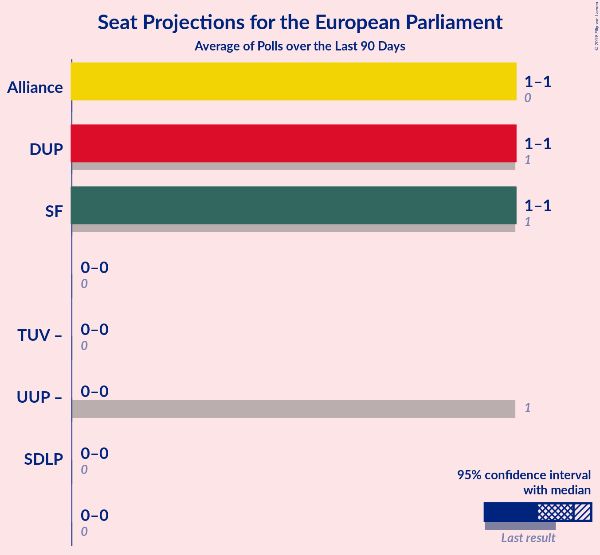

# Overview

The table below lists the most recent polls (less than 90 days old) registered and analyzed so far.

| Period     | Polling firm/Commissioner(s) | SF | DUP | UUP | SDLP | Alliance |
|:----------:|:----------------------------:|:--:|:--:|:--:|:--:|:--:|
| 22 May 2014 | General Election | 25.5%   1 | 20.9%   1 | 13.3%   1 | 13.0%   0 | 7.1%   0 |
| N/A | [Poll Average](average.html) | N/A   N/A | N/A   N/A | N/A   N/A | N/A   N/A | N/A   N/A |
| [20 October–2 November 2018](2018-11-02-Survation.html) | Survation | N/A   N/A | N/A   N/A | N/A   N/A | N/A   N/A | N/A   N/A |
| 22 May 2014 | General Election | 25.5%   1 | 20.9%   1 | 13.3%   1 | 13.0%   0 | 7.1%   0 |

Only polls for which at least the sample size has been published are included in the table above.

**Legend:**
+ **Top half of each row:** Voting intentions (95% confidence interval)
+ **Bottom half of each row:** Seat projections for the European Parliament (95% confidence interval)
+ **SF:** Sinn Féin (GUE/NGL)
+ **DUP:** Democratic Unionist Party (NI)
+ **UUP:** Ulster Unionist Party (ECR)
+ **SDLP:** Social Democratic and Labour Party (S&D)
+ **Alliance:** Alliance Party of Northern Ireland (ALDE)
+ **N/A (single party):** Party not included the published results
+ **N/A (entire row):** Calculation for this opinion poll not started yet

