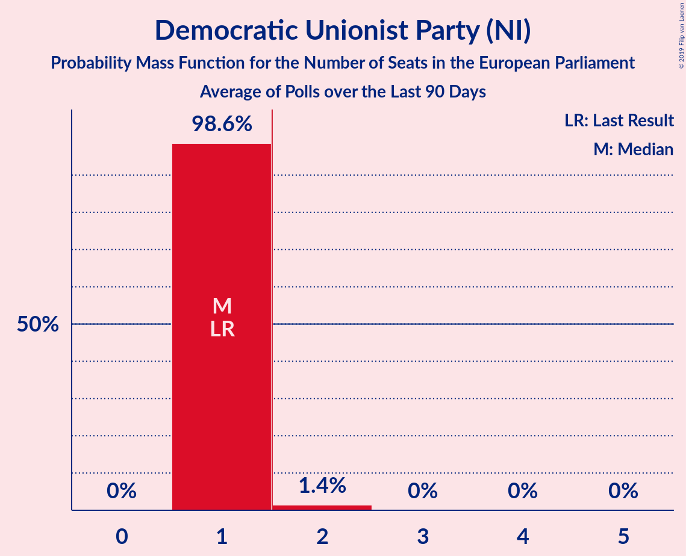

# Democratic Unionist Party (NI)

<a href="#voting-intentions">Voting Intentions</a> | <a href="#seats">Seats</a>

## Voting Intentions

Last result: **20.9%** (General Election of 23 May 2019)

### Confidence Intervals

| Period     | Polling firm/Commissioner(s) | Median | 80% Confidence Interval | 90% Confidence Interval | 95% Confidence Interval | 99% Confidence Interval |
|:----------:|:----------------:|:-----------:|:-----------------------:|:-----------------------:|:-----------------------:|:-----------------------:|
| N/A | [Poll Average](average.html) | 28.0% | 26.8–29.2% | 26.5–29.5% | 26.2–29.8% | 25.7–30.4% |
| [30 October–1 November 2019](2019-11-01-LucidTalk.html) | LucidTalk   Remain United | 28.0% | 26.8–29.2% | 26.5–29.5% | 26.2–29.8% | 25.7–30.4% |
| [9–12 August 2019](2019-08-12-LucidTalk.html) | LucidTalk | 29.0% | 27.8–30.3% | 27.5–30.6% | 27.2–30.9% | 26.6–31.5% |

### Probability Mass Function

The following table shows the probability mass function per percentage block of voting intentions for the [poll average](average.html) for Democratic Unionist Party (NI).

| Voting Intentions | Probability | Accumulated | Special Marks |
|:-----------------:|:-----------:|:-----------:|:-------------:|
| 20.5–21.5% | 0% | 100% | Last Result |
| 21.5–22.5% | 0% | 100% |  |
| 22.5–23.5% | 0% | 100% |  |
| 23.5–24.5% | 0% | 100% |  |
| 24.5–25.5% | 0.3% | 100% |  |
| 25.5–26.5% | 5% | 99.7% |  |
| 26.5–27.5% | 26% | 95% |  |
| 27.5–28.5% | 41% | 69% | Median |
| 28.5–29.5% | 23% | 28% |  |
| 29.5–30.5% | 4% | 5% |  |
| 30.5–31.5% | 0.3% | 0.3% |  |
| 31.5–32.5% | 0% | 0% |  |

## Seats

Last result: **1** seats (General Election of 23 May 2019)

### Confidence Intervals

| Period     | Polling firm/Commissioner(s) | Median | 80% Confidence Interval | 90% Confidence Interval | 95% Confidence Interval | 99% Confidence Interval |
|:----------:|:----------------:|:------:|:-----------------------:|:-----------------------:|:-----------------------:|:-----------------------:|
| N/A | [Poll Average](average.html) | 1 | 1 | 1 | 1 | 1–2 |
| [30 October–1 November 2019](2019-11-01-LucidTalk.html) | LucidTalk   Remain United | 1 | 1 | 1 | 1 | 1–2 |
| [9–12 August 2019](2019-08-12-LucidTalk.html) | LucidTalk | 1 | 1 | 1 | 1 | 1 |

### Probability Mass Function

The following table shows the probability mass function per seat for the [poll average](average.html) for Democratic Unionist Party (NI).

| Number of Seats | Probability | Accumulated | Special Marks |
|:---------------:|:-----------:|:-----------:|:-------------:|
| 1 | 98% | 100% | Last Result, Median |
| 2 | 2% | 2% | Majority |
| 3 | 0% | 0% |  |

