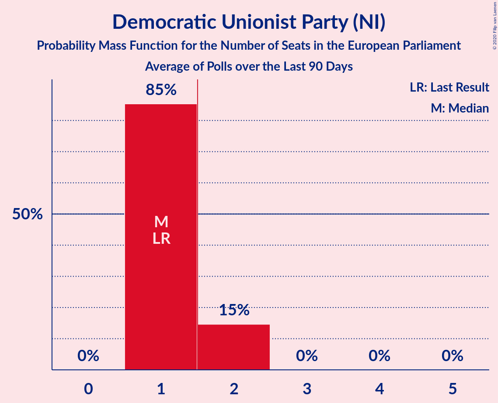

# Democratic Unionist Party (NI)

<a href="#voting-intentions">Voting Intentions</a> | <a href="#seats">Seats</a>

## Voting Intentions

Last result: **20.9%** (General Election of 22 May 2014)

### Confidence Intervals

| Period     | Polling firm/Commissioner(s) | Median | 80% Confidence Interval | 90% Confidence Interval | 95% Confidence Interval | 99% Confidence Interval |
|:----------:|:----------------:|:-----------:|:-----------------------:|:-----------------------:|:-----------------------:|:-----------------------:|
| N/A | [Poll Average](average.html) | 31.0% | 28.6–33.6% | 27.9–34.3% | 27.3–35.0% | 26.1–36.2% |
| [20 October–2 November 2018](2018-11-02-Survation.html) | Survation | 31.0% | 28.6–33.6% | 27.9–34.3% | 27.3–35.0% | 26.1–36.2% |

### Probability Mass Function

The following table shows the probability mass function per percentage block of voting intentions for the [poll average](average.html) for Democratic Unionist Party (NI).

| Voting Intentions | Probability | Accumulated | Special Marks |
|:-----------------:|:-----------:|:-----------:|:-------------:|
| 20.5–21.5% | 0% | 100% | Last Result |
| 21.5–22.5% | 0% | 100% |  |
| 22.5–23.5% | 0% | 100% |  |
| 23.5–24.5% | 0% | 100% |  |
| 24.5–25.5% | 0.2% | 100% |  |
| 25.5–26.5% | 0.7% | 99.8% |  |
| 26.5–27.5% | 3% | 99.1% |  |
| 27.5–28.5% | 6% | 97% |  |
| 28.5–29.5% | 12% | 90% |  |
| 29.5–30.5% | 18% | 78% |  |
| 30.5–31.5% | 20% | 60% | Median |
| 31.5–32.5% | 18% | 40% |  |
| 32.5–33.5% | 12% | 22% |  |
| 33.5–34.5% | 6% | 10% |  |
| 34.5–35.5% | 3% | 4% |  |
| 35.5–36.5% | 0.9% | 1.2% |  |
| 36.5–37.5% | 0.2% | 0.3% |  |
| 37.5–38.5% | 0.1% | 0.1% |  |
| 38.5–39.5% | 0% | 0% |  |

## Seats

Last result: **1** seats (General Election of 22 May 2014)

### Confidence Intervals

| Period     | Polling firm/Commissioner(s) | Median | 80% Confidence Interval | 90% Confidence Interval | 95% Confidence Interval | 99% Confidence Interval |
|:----------:|:----------------:|:------:|:-----------------------:|:-----------------------:|:-----------------------:|:-----------------------:|
| N/A | [Poll Average](average.html) | 2 | 1–2 | 1–2 | 1–2 | 1–2 |
| [20 October–2 November 2018](2018-11-02-Survation.html) | Survation | 2 | 1–2 | 1–2 | 1–2 | 1–2 |

### Probability Mass Function

The following table shows the probability mass function per seat for the [poll average](average.html) for Democratic Unionist Party (NI).

| Number of Seats | Probability | Accumulated | Special Marks |
|:---------------:|:-----------:|:-----------:|:-------------:|
| 1 | 46% | 100% | Last Result |
| 2 | 54% | 54% | Median, Majority |
| 3 | 0% | 0% |  |

