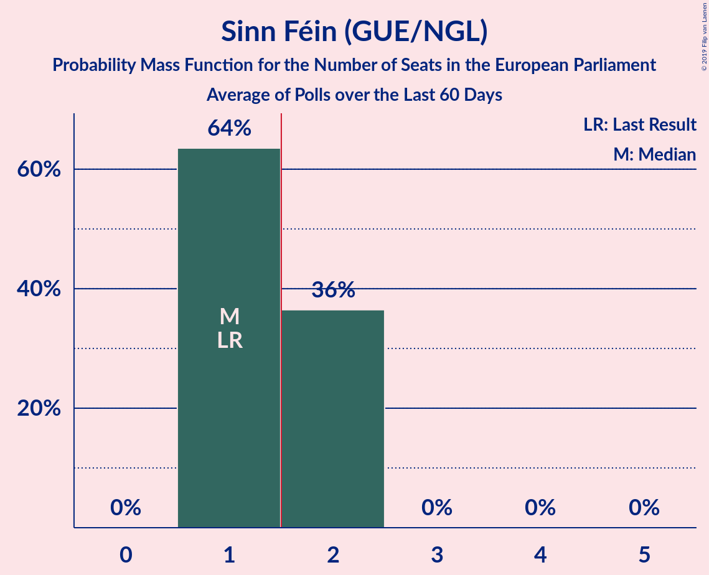

# Sinn Féin (GUE/NGL)

<a href="#voting-intentions">Voting Intentions</a> | <a href="#seats">Seats</a>

## Voting Intentions

Last result: **25.5%** (General Election of 23 May 2019)

### Confidence Intervals

| Period     | Polling firm/Commissioner(s) | Median | 80% Confidence Interval | 90% Confidence Interval | 95% Confidence Interval | 99% Confidence Interval |
|:----------:|:----------------:|:-----------:|:-----------------------:|:-----------------------:|:-----------------------:|:-----------------------:|
| N/A | [Poll Average](average.html) | 25.0% | 23.9–26.2% | 23.6–26.5% | 23.3–26.8% | 22.8–27.3% |
| [27–30 November 2019](2019-11-30-LucidTalk.html) | LucidTalk   Remain United | 25.0% | 23.9–26.2% | 23.6–26.5% | 23.3–26.8% | 22.8–27.3% |
| [30 October–1 November 2019](2019-11-01-LucidTalk.html) | LucidTalk   Remain United | 24.0% | 22.9–25.2% | 22.6–25.5% | 22.3–25.8% | 21.8–26.3% |
| [9–12 August 2019](2019-08-12-LucidTalk.html) | LucidTalk | 25.0% | 23.9–26.2% | 23.6–26.6% | 23.3–26.8% | 22.8–27.4% |

### Probability Mass Function

The following table shows the probability mass function per percentage block of voting intentions for the [poll average](average.html) for Sinn Féin (GUE/NGL).

| Voting Intentions | Probability | Accumulated | Special Marks |
|:-----------------:|:-----------:|:-----------:|:-------------:|
| 20.5–21.5% | 0% | 100% |  |
| 21.5–22.5% | 0.2% | 100% |  |
| 22.5–23.5% | 4% | 99.8% |  |
| 23.5–24.5% | 25% | 96% |  |
| 24.5–25.5% | 43% | 71% | Median |
| 25.5–26.5% | 24% | 28% | Last Result |
| 26.5–27.5% | 4% | 4% |  |
| 27.5–28.5% | 0.2% | 0.2% |  |
| 28.5–29.5% | 0% | 0% |  |

## Seats

Last result: **1** seats (General Election of 23 May 2019)

### Confidence Intervals

| Period     | Polling firm/Commissioner(s) | Median | 80% Confidence Interval | 90% Confidence Interval | 95% Confidence Interval | 99% Confidence Interval |
|:----------:|:----------------:|:------:|:-----------------------:|:-----------------------:|:-----------------------:|:-----------------------:|
| N/A | [Poll Average](average.html) | 1 | 1 | 1 | 1 | 1 |
| [27–30 November 2019](2019-11-30-LucidTalk.html) | LucidTalk   Remain United | 1 | 1 | 1 | 1 | 1 |
| [30 October–1 November 2019](2019-11-01-LucidTalk.html) | LucidTalk   Remain United | 1 | 1 | 1 | 1 | 1 |
| [9–12 August 2019](2019-08-12-LucidTalk.html) | LucidTalk | 1 | 1 | 1 | 1 | 1 |

### Probability Mass Function

The following table shows the probability mass function per seat for the [poll average](average.html) for Sinn Féin (GUE/NGL).

| Number of Seats | Probability | Accumulated | Special Marks |
|:---------------:|:-----------:|:-----------:|:-------------:|
| 1 | 100% | 100% | Last Result, Median |

