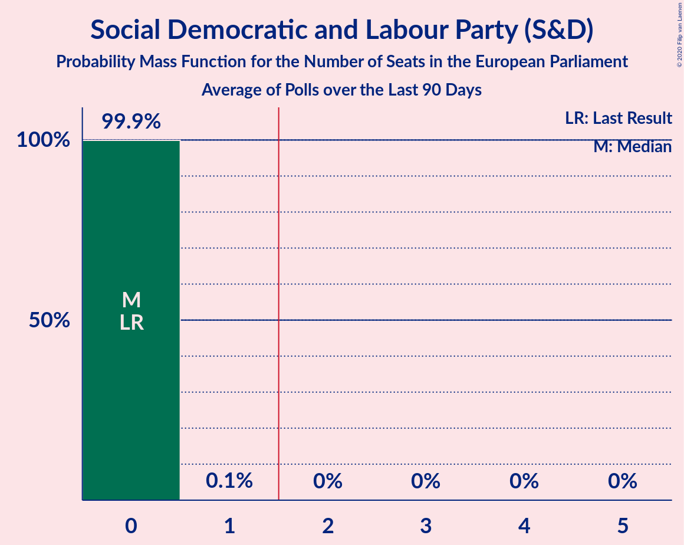

# Social Democratic and Labour Party (S&D)

<a href="#voting-intentions">Voting Intentions</a> | <a href="#seats">Seats</a>

## Voting Intentions

Last result: **13.0%** (General Election of 23 May 2019)

### Confidence Intervals

| Period     | Polling firm/Commissioner(s) | Median | 80% Confidence Interval | 90% Confidence Interval | 95% Confidence Interval | 99% Confidence Interval |
|:----------:|:----------------:|:-----------:|:-----------------------:|:-----------------------:|:-----------------------:|:-----------------------:|
| N/A | [Poll Average](average.html) | 13.0% | 12.2–13.9% | 11.9–14.2% | 11.7–14.4% | 11.3–14.9% |
| [27–30 November 2019](2019-11-30-LucidTalk.html) | LucidTalk   Remain United | 13.0% | 12.2–13.9% | 11.9–14.2% | 11.7–14.4% | 11.3–14.9% |
| [30 October–1 November 2019](2019-11-01-LucidTalk.html) | LucidTalk   Remain United | 14.0% | 13.1–15.0% | 12.9–15.2% | 12.7–15.5% | 12.3–15.9% |
| [9–12 August 2019](2019-08-12-LucidTalk.html) | LucidTalk | 8.0% | 7.3–8.8% | 7.1–9.0% | 7.0–9.2% | 6.6–9.6% |

### Probability Mass Function

The following table shows the probability mass function per percentage block of voting intentions for the [poll average](average.html) for Social Democratic and Labour Party (S&D).

| Voting Intentions | Probability | Accumulated | Special Marks |
|:-----------------:|:-----------:|:-----------:|:-------------:|
| 9.5–10.5% | 0% | 100% |  |
| 10.5–11.5% | 1.3% | 100% |  |
| 11.5–12.5% | 22% | 98.7% |  |
| 12.5–13.5% | 54% | 76% | Last Result, Median |
| 13.5–14.5% | 21% | 22% |  |
| 14.5–15.5% | 1.5% | 1.5% |  |
| 15.5–16.5% | 0% | 0% |  |

## Seats

Last result: **0** seats (General Election of 23 May 2019)

### Confidence Intervals

| Period     | Polling firm/Commissioner(s) | Median | 80% Confidence Interval | 90% Confidence Interval | 95% Confidence Interval | 99% Confidence Interval |
|:----------:|:----------------:|:------:|:-----------------------:|:-----------------------:|:-----------------------:|:-----------------------:|
| N/A | [Poll Average](average.html) | 0 | 0 | 0 | 0 | 0 |
| [27–30 November 2019](2019-11-30-LucidTalk.html) | LucidTalk   Remain United | 0 | 0 | 0 | 0 | 0 |
| [30 October–1 November 2019](2019-11-01-LucidTalk.html) | LucidTalk   Remain United | 0 | 0 | 0 | 0–1 | 0–1 |
| [9–12 August 2019](2019-08-12-LucidTalk.html) | LucidTalk | 0 | 0 | 0 | 0 | 0 |

### Probability Mass Function

The following table shows the probability mass function per seat for the [poll average](average.html) for Social Democratic and Labour Party (S&D).

| Number of Seats | Probability | Accumulated | Special Marks |
|:---------------:|:-----------:|:-----------:|:-------------:|
| 0 | 99.9% | 100% | Last Result, Median |
| 1 | 0.1% | 0.1% |  |
| 2 | 0% | 0% | Majority |

