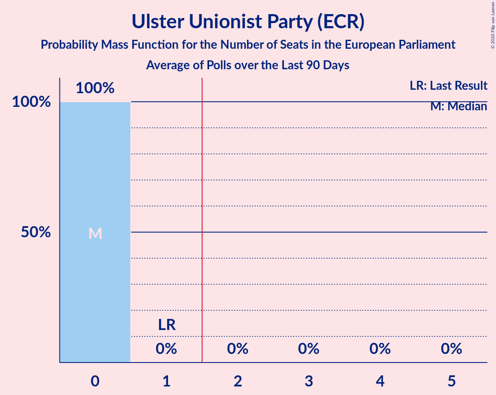

# Ulster Unionist Party (ECR)

<a href="#voting-intentions">Voting Intentions</a> | <a href="#seats">Seats</a>

## Voting Intentions

Last result: **13.3%** (General Election of 22 May 2014)

### Confidence Intervals

| Period     | Polling firm/Commissioner(s) | Median | 80% Confidence Interval | 90% Confidence Interval | 95% Confidence Interval | 99% Confidence Interval |
|:----------:|:----------------:|:-----------:|:-----------------------:|:-----------------------:|:-----------------------:|:-----------------------:|
| N/A | [Poll Average](average.html) | 11.6% | 10.6–12.7% | 10.3–13.1% | 10.1–13.3% | 9.6–13.9% |
| [18–19 May 2019](2019-05-19-LucidTalk.html) | LucidTalk | 11.6% | 10.6–12.7% | 10.3–13.1% | 10.1–13.3% | 9.6–13.9% |
| [4–7 May 2019](2019-05-07-LucidTalk.html) | LucidTalk | 11.8% | 10.8–13.0% | 10.5–13.3% | 10.2–13.6% | 9.7–14.2% |
| [20 October–2 November 2018](2018-11-02-Survation.html) | Survation | 15.0% | 13.2–17.1% | 12.7–17.6% | 12.2–18.2% | 11.4–19.2% |

### Probability Mass Function

The following table shows the probability mass function per percentage block of voting intentions for the [poll average](average.html) for Ulster Unionist Party (ECR).

| Voting Intentions | Probability | Accumulated | Special Marks |
|:-----------------:|:-----------:|:-----------:|:-------------:|
| 7.5–8.5% | 0% | 100% |  |
| 8.5–9.5% | 0.4% | 100% |  |
| 9.5–10.5% | 8% | 99.6% |  |
| 10.5–11.5% | 37% | 91% |  |
| 11.5–12.5% | 40% | 54% | Median |
| 12.5–13.5% | 13% | 14% | Last Result |
| 13.5–14.5% | 1.4% | 1.4% |  |
| 14.5–15.5% | 0.1% | 0.1% |  |
| 15.5–16.5% | 0% | 0% |  |

## Seats

Last result: **1** seats (General Election of 22 May 2014)

### Confidence Intervals

| Period     | Polling firm/Commissioner(s) | Median | 80% Confidence Interval | 90% Confidence Interval | 95% Confidence Interval | 99% Confidence Interval |
|:----------:|:----------------:|:------:|:-----------------------:|:-----------------------:|:-----------------------:|:-----------------------:|
| N/A | [Poll Average](average.html) | 0 | 0 | 0 | 0–1 | 0–1 |
| [18–19 May 2019](2019-05-19-LucidTalk.html) | LucidTalk | 0 | 0 | 0 | 0–1 | 0–1 |
| [4–7 May 2019](2019-05-07-LucidTalk.html) | LucidTalk | 0 | 0 | 0 | 0–1 | 0–1 |
| [20 October–2 November 2018](2018-11-02-Survation.html) | Survation | 0 | 0–1 | 0–1 | 0–1 | 0–1 |

### Probability Mass Function

The following table shows the probability mass function per seat for the [poll average](average.html) for Ulster Unionist Party (ECR).

| Number of Seats | Probability | Accumulated | Special Marks |
|:---------------:|:-----------:|:-----------:|:-------------:|
| 0 | 96% | 100% | Median |
| 1 | 4% | 4% | Last Result |
| 2 | 0% | 0% | Majority |

